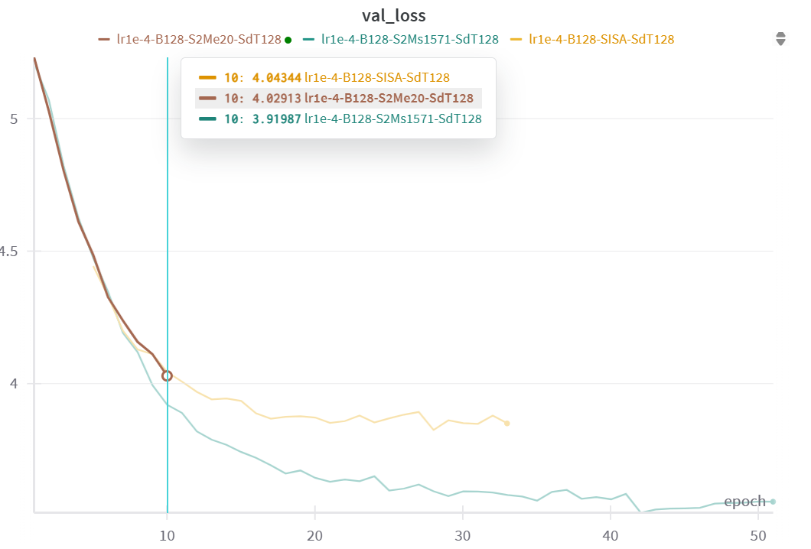

### 08/11/2025: Setup and Issues with VGGSound

#### **Summary of Work**
- Installed `ffmpeg` and Python on WSL.
- Tried setting up the code for installing VGGSound but faced significant issues due to compatibility and outdated dependencies.

#### **Problems Encountered**
- The repository for VGGSound is MacOS-focused, causing challenges in WSL.
- Conflict between `youtube-dl` and ``yt-dlp``:
    - **Issue**: Repository uses ``pafy`` with ``youtube-dl`` as the backend, which is outdated and doesn't work properly.

#### **Attempts Made**
- Installed ``youtube-dl`` and ``pafy`` on WSL → Unable to find videos.
- Installed ``miniconda`` as suggested with the corresponding Python requirements → Output was ``None``.
- Installed ``yt-dlp`` and manually tested it → Successfully found and downloaded videos but to be implemented for the whole dataset requires major code changes.

#### **Next Steps**
- Option 1: Use Flickr-SoundNet instead of VGGSound.
- Option 2: Ask Xavier for guidance on VGGSound.
- Option 3: Continue working on VGGSound in WSL:
    - Replace pafy code with alternatives like import yt_dlp as pafy.
    - Rewrite the entire code to use yt-dlp.

#### **Time Spent**
The whole day

### 09/11/2025: 
I just decided that I will use Flickr-SoundNet instead of VGGSound.
1. Understand how the code uses this dataset. Now it is written at the study of the code
2. I proved that the dataset is unique and has all the videos that I need, the ones that ``test_flickr_250.txt`` demands
3. Now everything is stored correctly for the Flickr-SoundNet dataset. Now it is time to test the model!

I managed to test the model with Flickr10k, proof:
```shell
TEST dataset size: 249
100%|███████████████████████████████████████████████████████████████████████████████████████████████████████| 249/249 [01:04<00:00,  3.89it/s]
Test:    Epoch: [33]    Loss: 0.0375 Acc@1: 0.0000 Acc@5: 0.0000 MeancIoU: 0.7791 AUC: 0.5927
```
Important things to note:
- I had to change the audio format from ``.wav`` to ``.mp3`` because the repo wants mp3 but torchaudio with soundfile as a backend doesn't support mp3. Since the change of extension should not affect mininmally the audio, I decided to do it. Remember that we use soundfile as a backend because since I use Windows, I can't use ``sox_audio``  for ``torchaudio==0.7.2``.
- I had to change the number of workers from 16 to 8 because it was causing a memory error. The repo origanally could handle 16 workers, but my computer has only 8 cores.
- I had to also upload the xml annotations.
Then finally I could test the model with the Flickr-SoundNet dataset.

Tomorrow:
Understand the results

### 12/11/2025:

I read again the SSL-TIE paper. What I get from reading it this time,  is that I tested correctly the Flickr10k model and
I assume that we don't have the exact same results because of the change from `mp3` to `wav`. However, the paper states that audio are cutted
till 20 segs, which it is noticeable with the wav audios but no with mp3. The reading also inspired me to write the Related Work.

It is important to note that by reading again the paper of Xavier, we could apply the same idea for extending the datasets and Then
test our new version of SSL-TIE against their metrics of negative audio. Moreover, from checking its github I noticed that models are easily
deployed. Giving me the idea that when it means that the backbone is ResNet-18 you simply puts its weights and there you have it, I still
have to check if for example at the SSL-TIE the Siamese architechure is build in this repository.

Conversely, what makes a model different from the other is its training. All of them adopt different ways to apply data augmentation principles
and its losses functions, (The way that the model learns). Hence, to test is basically forward, get its output and analyse it against a benchmark.


### 13/01/2025:

Plan of the day:
1. Read the Dense AV
2. See if I can download PlacesAudio
3. Catch up from what gloria and I talked about doing at the end
4. read Clip-denoiser
5. have a plan for tomorrows meeting
6. write letter to the bsc and email to inetum.

By reading again DenseAV's, it is easy to recognize that this model is huge and relies on a lot of parameters since it has multihead attention. Still I have to understand what is the cls token, but both backbones are transformers. One interesting point is that penalizes when multiple attention head are activated(3.4 disentaglement Regularizer).

**2016 - Harwath - (PlacesAudio) Unsupervised Learning of Spoken Languag with Visual Context**
After reading it, I was lead to read the paper of PlacesAudio, which in it describes a model  which is capable of associating speech audio captions with images. Amazingly, it does not require a such big architechure compared to the DenseAV, so it gives hope for the development of the thesis.

Regarding the dataset, this one is obtained from a subset of Places 205, which is 2.5M images categorized into 205 classes. Then with Spoke JavaScript framework and with Google SpeechRecognition they manage to obtain 120.000 captions. These are published and splitted into 144.000 training set, a 2,400 development set(maybe val set), and 2.400 for test set. The average speech form caption is 9.5 secs, containing an average of 21.9 words.

**2018 - Harwarth - Jointly Discovering Visual Objects and Spoken Words**

Now in this paper, PlacesAudio had been extended to 402.835 image/caption pairs. Here they also use ADE20k image/speech caption whose underlying scene category is indeed in the Places 205 label set.


### 14/01/2025
Cosas que quiero hacer hoy:
- Hacer el log de reunion de hoy
- Enviar Carta BSC y correo a Inetum
- Hacer Roadmap de lo siguiente del TFG
- Mirar Vuelos y dedicar tiempo a pensar que puedo hacer
- Hacer algo mas del TFG

Today, me and Gloria had a meeting to talk about the progress of the project. We declared that the main aim  of the thesis  is to try and adapt SSL-TIE to get the audio temporal analysis as DenseAV or DAVENet.
Basically, the same thing of DAVENet but with SSL-TIE, ideal to get Natural Sounds as well, with ADE20k

Next, in order to improve it we can use DINO or CLIP-DINOiser because it does a finer localisation and segmantic localization, And do the same thing as DenseAV or CLIP-DINOiser. Add this features to our SSL-TIE.

Finally, do a huge aplication that by speaking or making sounds it will localize the considered subject. This is the final part of the thesis which indeed it will take time as well. This can be done with flask xd. I need to work A LOT bruv.

Therefore, here the roadmap:
#### ROADMAP, option 1:
1. Get access to the cluster and understand how it works
2. Create whole directory in the cluster
3. Create sbatch file in order to run (You have the support document that Xavier gave you)
4. I would run first a test
5. Upload somehow the datasets (PlacesAudio) and ADE20k
7. Analize how to get the temporal audio
6. Do a single epoch
7. Estimate time to do the whole dataset
If it's not to much
8. Train with PlacesAudio
9. Meanwhile create a script to see the work and analyse it
10. Then train with both (ADE20K and PlacesAudio)
11. See results with both
Else:
8. train with both
9. see results with both with the script done with both

#### ROADMAP option 2:
Basically prepare a subset and run them in my home computer

More things to mention about the meeting (because i remember on the while):
- My results of testing SSL-TIE are probably different because I tested it with a Windows and I've changed things for the code to run in windows, and Xavier suggests that the results are different probably because of this. It is recommendable to change the whole environment to ubuntu xdddd.

### 03/02/2025
I managed to get till the 5th milestone. I encountered many problems that I briefly mention in the following:
- Had to reset cluster password (resolved with support)
- No https connection (resolved with support)
- After downloading PlacesAudio, I found out that I had to download them from the original dataset (managed with openxlab)
- Only need 400k images, need to check if I got all of them (being done at the job 8656)
- In the cluster I only have modules cuda 11.8 and 12.1 which they will lead to many problems due to cuda 11.0 code based

Now I proceed to study how to achieve the temporal variable for SSL-TIE

### 06/02/2025
Since the code is based on pytorch 1.12.1 Cuda 11.0, Xavi suggested that instead to migrating all the code try first doing a test:
- I tried to create de conda env with for pytorch 1.12.1 but it was impossible since CUDA 11.8 cannot handle it. the function `torch.cuda.is_available()`  raises an error.
- I created a new environment called `ssl-118` that has pytorch 2.0.0 and CUDA 11.8 and it works. Now `torch.cuda.is_available()` returns `False`. It is expected to return `True`  once I submit the job to the cluster.

For the testing
- I managed to download the model of ssl-tie and the dataset of Flicrk10k and organised it as it required.

Important to mention:
- Now I can use all the Linux lines of code that were hidden since before it was impossible to run them in Windows. Therefore, a change of code is expected.

The test went all right with no issues however we still have the same difference with respect to the paper

### 07/02/2025
Things I could do today:
1. Read to understand how to get the temporal volume
    1. Read Mit paper
    2. Read SSL-TIE
    3. Read DenseAV
    4. See code MIT
    5. Understand and Study the code of the model SSL-TIE (AVE-NET)
    6. Understand the training code
    7. Implement the code
    8. Document everything
    
1.1. My assumption is that this 3rd order tensor M is the final computation and contains all the similarity between the spatial location and temporal of the audio 14 x 14 x 128. They expect these dimensions to be at least recoverable to detect a decent object size and a to at least catching a words within each activation.

It is interesting to see how the conv5 is really important, firstly noted by Zhou et al (Learning deep features for discriminative
localization.) What i think about conv5 is 5x5 filter. They note that they don't couple conv5 to fc1 because that it's a flattening operation meaning that in this way they are able to recover the associations between neurons above and the localisation stimulus that is responsible for the output.

Many interesting techniques to address the problem are described in this paper

- Vision enconder: (14 x 14 x 512/1024)  they apply a 3x3 linear convolution to get the 1024 chanel
- Audio encoder:    (128 x 1024) 128 for the temporal


### 11/02/2025
1.2 Reading SSL-TIE
Remember Siamese Network:
    - Two identical branches with audio and image encoders
    - They use Chen [6] treating the foreground as a negative pair plus unpaired signals
    - Here the shape of the video encoder (14 x 14 x 512) and the shape of audio features(1 x 512)

Purpose of using SSL-TIE:
They key thing of this is that their approach of invariance and equivariance (data augmentation) has been proved that has a audiovisual understanding performing best at Sound Source Localisation
Therefore, in this thesis by means of this approach we try to align the model to Language Spoken modality as done by Hamilton et al. (2024) but with this architecture.
However, since SSL-TIE detects the SS by processing the 10 secs of audio entirely, its audio encoder architecture has to be changed in order to get the volume of similarities.
propose to change the audio feature:
At the end they use
    
### 12/02/2025
AudioConvNet DAVENet
```python
 def __init__(self, embedding_dim=1024):
        super(Davenet, self).__init__()
        self.embedding_dim = embedding_dim
        self.batchnorm1 = nn.BatchNorm2d(1) # One channel input BW
        self.conv1 = nn.Conv2d(1, 128, kernel_size=(40,1), stride=(1,1), padding=(0,0)) # 
        self.conv2 = nn.Conv2d(128, 256, kernel_size=(1,11), stride=(1,1), padding=(0,5))
        self.conv3 = nn.Conv2d(256, 512, kernel_size=(1,17), stride=(1,1), padding=(0,8))
        self.conv4 = nn.Conv2d(512, 512, kernel_size=(1,17), stride=(1,1), padding=(0,8))
        self.conv5 = nn.Conv2d(512, embedding_dim, kernel_size=(1,17), stride=(1,1), padding=(0,8))
        self.pool = nn.MaxPool2d(kernel_size=(1,3), stride=(1,2),padding=(0,1))

    def forward(self, x):
        if x.dim() == 3: # It has to be bw
            x = x.unsqueeze(1) 

        x = self.batchnorm1(x)      # 1024 x 40 x 1
        x = F.relu(self.conv1(x))   # 1024 x 1 x 128
        x = F.relu(self.conv2(x))   # 1024 x 1 x 256 (kernel 1x11 + padding 0x5)
        x = self.pool(x)            # 512 x 1 x 256
        x = F.relu(self.conv3(x))   # 512 x 1 x 512 (kernel 1x17 + padding 0x8)
        x = self.pool(x)            # 256 x 1 x 512
        x = F.relu(self.conv4(x))   # 256 x 1 x 512 (kernel 1x17 + padding 0x8)
        x = self.pool(x)            # 128 x 1 x 512
        x = F.relu(self.conv5(x))   # 128 x 1 x 1024 (kernel 1x17 + padding 0x8)
        x = self.pool(x)            # 64 x 1 x 1024 It should be 128 This maxpooling shouldn't exist
        x = x.squeeze(2)
        return x

```
 the convolution in your code is done with a non-square filter. The kernel size (40, 1) indicates that the filter has a height of 40 and a width of 1. This means the convolution will apply a filter that is tall and narrow, which can be useful for certain types of data, such as audio spectrograms where you might want to capture patterns across frequency bands (height) while preserving the time dimension (width).

### 13/02/2025
So basically this day I managed to:
- reorder my data and put everything at `$DATA`
- Install conda at my laptop
- Create environment to use pytorch in my laptop for later debugging
- Modify code in order to use either cuda environment or cpu
- Check the modification by launching a test with Flickr10k (It passed)
- Start the preparation for debugging the code (``debug_training.sh``)
- We manage to install all the packages correctedly and now we know that we can debug till the breakpoint

Things for tomorrow:
- Make the code possible to use only just a sample in order to train the model
- Check the pipeline
- Decide on the average pooling
- Check what else in the meeting notes

### 15/02/2025
Today we are learning on how to debug

Things to note:
- we may understand later what are the purpose of args.eval_start and args.eval_freq and model_without_dp.state_dict()

Things done:
- Create Launch.json in order to debug the code with the desired parameters
- We understood how the pipeline would go for training by debugging the code
- Now introducing a new dataset_mode called debug
- Upload some sample images and respective audios for dataset debug
- Thanks to debugging, some parameters the model `img_aug` and `aud_aug` are now described in opts file

### 17/02/2025
So today finally we ended debbugging the whole pipeline meaning that
1. We added correctly the `dataset_mode` to `Debug` correctly
2. We wrote down the whole pipeline of the AVENet at the notebook (Todo Daily), the image and the aud
    the audio is worth studying
3. We noted down at ``notes_about_opts.md`` glimpses of aud_aug for the future
4. ``model.py`` required some changes in order to work with CPU
5. We added at the ``launch.json``
6. We also added args.testset_path explained at notes_about_opts.md and the txt for the Dataloader in case of using dir_for_debugging

Things important to note:
1. We wrote down when the model averages the temporal dimension and how it joins both embeddings [torch.einsum, line 284](./models/model.py#L76) 
2. The pipeline works presumably well. However, at training, once the heatmap is forwarded we catch an Exception when the code tries to calculate `calc_topk_accuracy`
```python
top1, top5 = calc_topk_accuracy(out, target, (1,5))
```
[train_one_epoch( ), main.py](main.py#144) Which the error says that index went out of range, which I assume that it is due to having only 5 samples in the dataset and that this is probably the adding thing of negative samples.

3. The testing with `Debug` would work well eventually

### 19/02/2025
After reading what we did the other day, we have few things that we could start from. I had an interview that really got me unmindful So what i know for sure is the following:

1. We did an analysis on how the input audio is transformed into spectrogram. In which the conclusion is that SSL-TIE respects the temporal resolution while having high frequency resolution compared to DenseAV and DAVENet.

2. SSL-TIE doesn't fully stack the frequential and does reduces the Temporal two times more than DAVENet

[CHECK word ``AUDIO ENCODER INFORMATION``]

Suggestion to do:

1. Do another main that doesn't use the masks 

2. Suggest that maybe  avoiding  another maxpool could lead to better temporal activations

TO DO:

1. Check Harwath how does this the joining 
2. Start by creating a more functional main. Maybe we have to see if we need to restructure the code to make it more reusable by means of encapsulation 
3. Prepare the whole dataset
4. Study how to implement Wandb here. Maybe ask Xavi
5. [If possible] Launch one epoch to inform the whole dataset process.

### 20/02/2025

Acording to the To Do of yesterday:
1. Harwarth computes the triplet margin ranking loss for each anchor image/caption pair and the impostor image/caption is randomly sampled from the minibatch. [Link](../DAVEnet-pytorch/steps/util.py#88)

Then it uses ``torch.mm`` to join both embedding [Link](../DAVEnet-pytorch/steps/util.py#62)

2. We start by adding a parameter for requesting the three order tensor in opts.py


Things to note:
The logits contains the similarity score between the positive regions and negative ones.
The target in this case should be zero because there should be no correlation.
That's why the criterion is nn.CrossEntropyLoss().
Tbh I can't see if they use negative audios for the cl_loss

Maybe we should propose a new framework for the Siamese concept of equivariance.


Therefore I proceed to calculate the same loss as DAVENet:

Finished for today but in the bus im adding the PlacesAudio dataset:
1. The model has been modified to output only the audio and video feature maps (it doesn't compute the mask). The option --order_3_tensor triggers this.
2. A LinearConv has been added to increase the embd dimensions from 512 to 1024 [link model.py](./models/model.py#L124)
3. main.py has been also modified to do epochs with the matchmap approach
4. This new trainer can avoid the siamese equivariance configuration by not putting the opt --siamese
5. Now that the model computes the matchmap it will compute its loss by the triple marging ranking loss
6. We added at util.py the functions and approaches by Harwath et. al 2018
7. In opts it has been added the following: --simtype (MISA | SISA | SIMA) --order_3_tensor and --siamese
8. launch.json has also this new config
9. A debugging has been completed and fulfills the following requirements:
    1. The output dimensions of the matchmap is 14 x 14 x 58 considering and embedding dimension of 1024
    2. The loss has been correctly computed
    3. All the epochs are correctly done
    4. It catches an exception when it wants to do the validation

Things for next time:
1. Maybe we have to consider a new concept of equivariance: transformations for 3D Tensors??
2. Now we have to add the Places Audio dataset in the code 
3. Maybe we have to propose the validation of Harwath but not that frequently
4. Check the Spec aug!!!!

Questions for tomorrow:
- Is it true that they apply all of this transformations but is not meant as data augmentation? Becaues they never use the original samples

### 21/02/2025
Today we had reunion and everything is written down at Notes - TFG Albert Santos

Task of today 
- maybe do the toy example
DONE

### 25/02/2025
So today we started by checking again the toy example therefore we proceed to study how to implement the PlacesAudio Dataset:
- We took a look on how DenseAV manages this:
    1. It uses a abstract class to define the main properties
    2. It has an extensive control on the path settings and manages metadata maybe for each instance with a df. It is not worth to check
    3. However we could apply the same idea in order to manage better future datasets each one using the same data augmentation propierties.
- I would like to check the propierties and statistics of places audio because maybe we don't have to crop from the center like Harwath does...
- Now put ffmpeg in conda to get the statistics
1. Install ffmpeg locally in the env of 'ssl-cpu'
2. After checking the stats of for example flickr we notice that they are 256x256. SSL-TIE inorder to tackle this it uses a ``RandomResizeCrop`` to 224 if the img_aug is specified, if not a normal `Resize(224, Image.BICUBIC)` so it always uses this cropping. [Reference(dataloader)](./datasets/dataloader.py#L204)
3. We checked the statistics PlacesAudio with ffmpeg at the cluster. Things to note:
    1. fs 16kz
    2. Images are 256x256

Now let us do the abstract class for AVDataset:

Okay so this abstract it only initializes the init and the desired transforms. The get item will stay with the minor change of retrieving the files by other methods. this other methods are abstract and they have to be overriden.
the methods are:
- `__len__`
- `_get_file(self,index)`
- `_get_video(self,file)`
- `_get_audio(self,file)`

Therefore the PlacesAudio class is a child class from AVDAtaset and it retrieves the data by parsing the json file, and all of this is thanks to overriding these functions. The desired split for PlacesAudio it comes with the json file.

### 26/02/2025
- We corrected the use of CUDA and added a handler that if using gpu is desired and cuda is  not enabled it stops the execution

- We finally managed to do one epoch and it lasted 26 minuts

Now we plan to implement WandB:
1. Put all the loggers correctly [X]
2. Save the model correctly [x]
    What I would like is that all the models are saved in `$HOME/models/exp_name/...` And exp_name should exist at CLI trigger
2. Do a mini dataset 
3. Check some epochs
4. implement the images and videos
5. Launch training!!
6. 

add the following:
```python
    import json

    json_file = "train.json"

    with open(json_file, 'r') as f:
        data_json = json.load(f)

    data = data_json['data']
    image_base_path = data_json['image_base_path']
    audio_base_path = data_json['audio_base_path']
    print(image_base_path, audio_base_path)
    print(len(data))

    print(data[0]['image'])

    import random
    # Create a new json file
    new_json_file = "train_subset.json"
    # pick randomnly 320 samples
    subset = random.sample(data, 20)
    # write the subset to the new json file
    dict_json = {'image_base_path': image_base_path, 'audio_base_path': audio_base_path, 'data': subset}
    with open(new_json_file, 'w') as f:
        json.dump(dict_json, f)

    with open(new_json_file, 'r') as f:
        data_json = json.load(f)

    data_n = data_json
    print(data_n)
    print(data_n['data'][0]['image'])

```


### 27/02/2025

- We managed to implement WandB vaguely
- We reconfigured the way to save models
- It is expected to work correctly, thus I proceed to create a mini_subset to check the logs

MAP:
1. Do the subset [X]
   Check args.iteration[x]
   
2. Launch to the cluster  [x]
    1. see WandB procedural [x]
    2. check if the models are being saved [x]
    3. 
3. Check if I can resume training 
3. Put the images inferences somehow
4. Read to put the benchmarks as Harwarth


Notes: 
- In test they make the visualisation of the heatmap check [vis_heatmap_bbox()](./utils/util.py#L37)


Questions for the reunion:
- Shall I save the model every epoch?
- What is the jobs folder used for? And diff between run (meant for sbatch files)
- The name of the run can it be set manually?


This week progress:
1. Vaig fer un Toy Example i funciona esperadament 
    (21/02)

2. Donat que al repo de SSL-TIE té un control dels datasets horrible ( molts ifs)  doncs fixant-me en DenseAV he fet una abstract class de AVDataset.
    On fa totes les tranformacions de SSL-TIE i respecta clarament el processament de les dades.
    gràcies això podrem fer coses més naturalment com DenseAV de juntar diferent datasets, també respecta tot el que había abans
    Tot aixo debuguejat i demostrat

3. Since I was not sure of PlacesAudio I did a mini study with ffmpeg to check the dimensions of the image 256x256 i el samplerate 16 fs
    I did it because DAVENet does a center crop of the image and I was quite sckeptical of SSL-TIE which eventually it always does but with a random center.
    With val set it does a Resize to 224 and then a center crop of 224 like why [Reference](./datasets/dataloader.py#L357)

4. Fa tres dies el cluster no em deixaba utilitzar la GPU, no me la detectaba i bueno no he averiguat perquè passava aixó, però tinc ara un codi que si no es detecta i es demana gpu doncs que no entreni el model.
Al final va funcionar i va trigar en fer un epoch amb PlacesAudio 26 minuts i amb 100 epochs trigarà 2 dies. El vaig fer només per un perque el wandb el volia fet abans i totes les coses sobre com guardar els models

5. Doncs amb el repo de Julia i Xavier vaig aconseguir montar el wandb pero no es conectava a l'internet per una tonteria, i buah vaig trigar en veure'l. Jo ja em pensava que era un problema del cluster, tema proxies i tal.

6. Vaig fer un subset per veure com funciona el wandb

7. Vaig arreglar el merder de SSL-TIE que tenen per guardar models

8. Wandb funciona, pero CUDA_ERROR amb el subset a 6 epochs

9. Arreglat, només era que no li agradava el numero de workers

10. VG_SSL-TIE_subset wandb project

11. Ara que tot funciona he llançat el model pero no te encara com veure les imatges i els videos

12. tinc el roadmap començat 

Notes:
- gc per resetejar la memória
- fer proves per millor el batchsize i el num_workers
- mirar bé aixo de la mem de la GPU
- fer un random imatge ini


### 28/02/2025

I start by checking why the loss is not decreasing.

- First thing checked is the audio does not show a weird waveform, maybe normalizing could help
- NORMALIZED, it says that it's already normalized [Reference](./datasets/dataloader.py#L161)

- Spectrogram are dB so we cannot plot them

-Curiosamente en data loader frame.max (2.64) y min-1.4930


### 04/03/2025
Quizas una solución es acabar con los TB pk no sirven de nada y acceden a la memoria 

### 06/03/2025
Okay so the past days it has been very difficult to go on with the thesis due to the necessity of Networking at MWC therefore little progress have been done. 
- A new main called `main_efficient.py` has been created and this one has nothing to do with the original code it directly computes the matchmap and nothing with the TB
- Three new jobs were submitted yesterday and we have the following conclusions:

    `111384` -> ``normald-r_ord_loss`` has ``16 workers``  and batch size `32` 
            DIED at epoch 9 DataLoader starting again and system memory exploded to 11.57 (maybe GB)
            T-epoch. 1025 secs

    `111409` -> `n_w_4` has 4 workers batch size of 32
            Still running
            Somehow at almost 14 hours (48th epoch) the system memory fell drastically and curiosly it started reading from disk ¿?
            T-epoch 1110 secs aprox 18mins expected finishing time: 2 days and 6 hours
            The GPU memory used in this case is 9% we could double the batch size
            COMPLETED!!!!!!

    `111413` -> `mem_eff` 16 workers and batch size of 32
            DIED at epoch 3
            it had a sudden spike of in system memory 

    `120216`-> `n4_b64` 4 workers and batch size of 64 
            Still running

    `120214` -> `again_mem_eff` n16 b 32
            DIED at Wandb HOWEVER still running.

    `120221` -> `SISA_n4b64`
            Still running

    `120286` -> `n4_b128`
    Code is not available at the moment

    ### 07/03/2025

    Meeting today:
    - MWC coudlnt do much
    - He encontrado el problema y no la solución del loss
    - Input images as shown (Transformations are fine)
    - Ja tinc suposadament montat la pujada de videos al wandb i l'avaluació quantitativa de Harwarth (no té misteri es copiar i pegar(no posat en practica
    ))
    - Did another main  mas limpio because supose que el TB afectaba la memoria
    - He posat la possibilitat de netejar: 
        - la cuda cache dins del batch loader amb la desitjada ``frequencia`` i una vegada acabat el epoch, prime gc i despres cuda cache
    - No té un impacte significant, simplement pot evitar un increment de memoria inesperat el que sí acaba es amb la chain de Wandb
    - Si peta es pk ha passat algo amb el multiprocessing de python
    - Amb 16 workers sempre peta, només s'ha salvat un que li ha petat el wandb
    - Recomanació (n_cpus/2 or nGPUs*4) llavors amb 4 m'ha arribat fins al final
    - Faig proves amb n4 b 64 va bé  nomes incrementa l'us de la GPU pero no hiha significativament una reducció de temps
    
    - Proves que he fet per comprobar la baixada del loss:
        - Les imatges no so son negres
        - L'audio i els spectrogrames son aparentment coherents (freq bands cancelled maybe)
        - El loss es una mica especial peró te gradient i es un valor.

        - Els parametres requereixen gradient peró no es guarden llavors loss.backwards() No funciona

        - No sé pq pero jo el que faig es trobar on es trenca la cadena amb
            ```python
            for name, param in self.named_parameters():
                if param.requires_grad:
                    print(f"{name} has gradient computed: {param.grad is not None}")
            ```
        
            Pregunta, només fent una operació ja està en el graf, no?

    El nombre de workers afecta al començament del epoch, es tot el process


- Comentar a Xavi el InfoNCE loss

Feedback:
- Començo de nou el codi
- Aplico InfoNCE
- Connectar els grafos


### 12/03/2025

Today we launched the official code of SSL-TIE with PlacesAudio, apparently is learning something:
- We cloned the offical code
- We added WandB  and places audio dataset and modified to not do the validatons with anno
- It has been submitted to the cluster, now it's apparently learning

With this we confirm that the modifications to fit PlacesAudio do not prevent the model from learning

Now we proceed to apply loss made by Hamilton et al. 2024

pos
tensor([[8.9156e+03, 1.0000e+00, 1.0000e+00],
        [1.0000e+00, 7.5594e+03, 1.0000e+00],
        [1.0000e+00, 1.0000e+00, 8.2540e+03]], grad_fn=<ExpBackward0>)
neg
tensor([[1.0000e+00, 1.0003e+04, 8.2822e+03],
        [7.7864e+03, 1.0000e+00, 6.8114e+03],
        [9.5202e+03, 9.6058e+03, 1.0000e+00]], grad_fn=<ExpBackward0>)


### 14/03/2025

#### REUNIÓ:

1. SSL-TIE de 0:
    - Intentar descarregar Flickr-Sound
        El link cau avegades i no es descarrega complet
        Tot per reproduir els resultats
    - Modificacions:
        - Cluster
        - WandB
        - PlacesAudio Dataset class with the Abstract Class
    
Resultat:
Només entrenat amb PlacesAudio -> apren però lógicament s'estanca (invariant del temps)
Conclusió: La incorporació de PlacesAudio no és el problema

2. InfoNCE Loss (Aplicar Hamilton et al. 2024)

    1. El codi de Hamilton està a lightning, no consegueixo veure d'on surt les similarities 
        [Ref at init](DenseAV/denseav/train.py#L325)
        [Contrastive loss](DenseAV/denseav/train.py#L515)
        [Loss](DenseAV/denseav/train.py#L556)
        Es dedicar massa temps
    2. Implemento bassant-me al paper:
        Faig MISA pels B^2 samples, iterant pel batch dues vegades
Codi [Codi](./utils/util.py#L433)

```python
def infoNCE_loss(image_outputs, audio_outputs,args):
    """
        images_outputs (B x H x W x C) 
        audio_outputs  (B x T x C)
        Assumption: the channel dimension is already normalized
    """
    #gradient of image_outputs = grad_fn=<PermuteBackward0>
    B = image_outputs.size(0)
    device = image_outputs.device
    #TODO: Should we require grad to sims?
    sims = torch.zeros(B, B, device=device)
    mask = torch.eye(B, device=device)

    for i in range(B):
        for j in range(B):
            sim_i_j = matchmapSim(computeMatchmap(image_outputs[i], audio_outputs[j]), args.simtype)
            #sim_i_j grad_fn=<MeanBackward0>
            sims[i, j] = sim_i_j
    # sims grad_fn=<CopySlices>
    sims = torch.exp(sims / args.temperature) #0.07
    pos= sims * mask
    neg = sims * (1 - mask)

    # TODO: Normalize the rows and columns???
    # pos = pos / pos.sum(1, keepdim=True)
    # neg = neg / neg.sum(1, keepdim=True)

    # This iterates the images against their negative audios...
    loss_v_a = -torch.log(pos.sum(dim=1) / (pos.sum(dim=1) + neg.sum(dim=1))).mean() / 2 
    # This iterates the audios against their negative images...
    loss_a_v = -torch.log(pos.sum(dim=0) / (pos.sum(dim=0) + neg.sum(dim=0))).mean() / 2
    loss = loss_v_a + loss_a_v

    return loss

def computeMatchmap(I, A):
    """
    Computes the 3rd order tensor of matchmap between image and audio.
    Its the dot product.
    """
    assert(I.dim() == 3)
    assert(A.dim() == 2)  
    matchmap = torch.einsum('hwc,tc->hwt', I, A)
    return matchmap

def matchmapSim(M, simtype):
    assert(M.dim() == 3)
    if simtype == 'SISA':
        return M.mean()
    elif simtype == 'MISA':
        M_maxH, _ = M.max(0)
        M_maxHW, _ = M_maxH.max(0)
        return M_maxHW.mean()
    elif simtype == 'SIMA':
        M_maxT, _ = M.max(2)
        return M_maxT.mean()
    else:
        raise ValueError('Unknown similarity type: %s' % simtype)
```

El model no apren encara, els epochs ara trigan una hora.

### 18/03
The past few days I was developing the idea of the similarity matrix by means of outerproduct that were eased by torch.einsum. After proving a toy example the model has been is now implementing the InfoNCE loss.

Unfortunately, the model is still not learning. We proceed to study other type of solutions:
- `learning rate`
    SSL-TIE has ``1e-4`` by default and DAVEnet has ``0.001``

### 19/03
Aparently it learns even less with a bigger learning rate.
Let's try with a smaller one:
- Job `129726` lr ``1e-5`` It significant learned something but not considerable yet
- Job `129822` lr `1e-6` It takes to much time for an epoch somehow

- `grads`
    I examined the grads after lossbackward in both models. It turns out that the only difference are the new added layers, which they indeed have also gradient. To understand this please go the jobs folder at the cluster.
    Difference
    L#135 the following module.linearConv.weight has parameter
    L#136 the following module.linearConv.bias has parameter
- `init param`
    SSL-TIE does a weight Kaiming initialization which it has been proved by the job `19926` that works as expected. Meaning that it includes our new added layer
- `2layers`
    `129944` After finding out that in our model both encoders were sharing the same linearConvolution, which it makes no sense. Therefore I added a new layer so now they expand their channel dimension independently. 
    I launched two jobs with this new architecture
        1. `129943` with lr `1e-05` : Apparently it overfit less
        2. `129944` with lr `1e-04`: Doesn't learn
        3. `132291` with lr `5e-6`:  Just launched
        4. -- with lr `1e-6`: it learned something but way less compared to those with 1e-5 NOTE: this computation was done with one linDimExp layer 

### 21/03
With lr 1e-5 we proved that the model can learn. Interestingly making the layers independent for each encoder doesn't have a dramatic effect, which the subtle difference can be seen at the val_loss

Now we should see what the models have learned, thus, a code for visualizing the model output given its weights and the sample it's required.

Meanwhile, I will be launching jobs to see the effect of batch size.
- `batch_size`:
    With lr 1e-5
    1.  `132294` b128
    2.  `132328` b256
    3.  `132330` b64

### REUNION 21/03/2025
Repassar la passada reunió:
- Demostrar que el codi de PlacesAudio va ser assimilat com que no afectava al problema
- Aplicar el InfoNCE loss de Hamilton, el seu codi trigaré massa en entendre-ho.
- Mostrar formula Hamilton
- Vaig aplicar la meva lógica del fors anidats, (calcular la similaritat per cada combinació del B^2)
    - Els epochs trigan una hora i segueix sense aprendre

Avui:
- Nova implementació InfoNCE loss [Ref](./utils/util.py#L433)
    - Explicar la meva formulació? 
        S [B x B x T x H x W] 
        S_MI  max(h,w) [B x B x T] 
        S_MISA mean(t) [B x B ]
    - Explicar toy example?
    - Conseqüencies:
        - Segueix sense aprendre
        - Reducció T-epoch a <20 mins

- Verificar pq no baixa la loss del model:
    - Gradients, tot correcte Explain diff SS-TIE default and me
    - init parametres Kaiming
    - independent layers
    - lr ha tingut efecte pero overfitting significant
    - Harwarth i jo
    - mostrar grafs

- Babysitting:
    - probar de jugar amb la temp (0.07 em sembla bestia)
    - Batch sizes
    - Optimizers (no gaire important)
    - Siamese (new approach)

- Before this, develop new code for visualizing the model output given its weights and a sample wether it's in local or remote or in train set or val set


### 22/03
We noticed that the output of the spectogram depends on the amount of samples and its sample rate. Therefore, with less samples less windows and the output for places audio is (257,670) which is quite concerning because we get a aud embedding of (1024,42)... Is this something that we should consider??

Possible Fix: If you want both spectrograms to have the same time resolution, you can normalize the hop length by the sample rate

### 23/03
Las imágenes del val set con su img_transform salen así
[[[-2.117904  -2.0357141 -1.8044444]
  [-2.117904  -2.0357141 -1.8044444]
  [-2.117904  -2.0357141 -1.8044444]
  ...
  [-2.117904  -2.0357141 -1.8044444]
  [-2.117904  -2.0357141 -1.8044444]
  [-2.117904  -2.0357141 -1.8044444]]
ahora les voy a aplicar un normalization para plotearlas

Las imagenes quedan muy raras al ser ploteadas cuando se les aplica la transformación por default de validation, se deberia debugear el modelo para ver si ahí también pasa.

Todas tienen en comun que se quedan estrujadas al centro dejando el resto en un color  como negro azulado

Gracias a la función de vis_loader, hemos comprobado que las imágenes salen perfectas EN EL CLUSTER

It has been proved that the issue was because the resize operation had an extra parenthesis ((imgSize, Image.BICUBIC))

NOW given the configuration of SISA we are going to throw three jobs varying the learning rate:
- `133720` lr1e-3-2ly-B128-SISA -> Not able to learn
- `133719` lr1e-4-2ly-B128-SISA -> Not able to learn
- `133728` lr1e-5-2ly-B128-SISA -> It decreases faster than the ones with misa but then it goes slower, meaning that a mix could be beneficial


ROADMAP:
 - 1. Create the video for a given model and sample [DONE]
    - 1. 1. Maybe adding the audio is great
Why the last jobs are not working??? [Solved] Train_one_epoch was commented
 - 2. Try to use more than one GPU
 - 3. Do more ablation study
 - 4. Maybe 42 for the embedding time size is too little compared to harwath, that it's our main difference

 ### 24/03
TODO to today:
1. WandB last jobs analyze [Done]
2. More than one GPU [Done]
--- Ask support for the scratch variable [Done]
--- Do a good manage of scratch directory [Done]
3. Integrate Video to WandB [Done]
4. Add audio option
    -  Analyze how much time it introduces the adding the audio
    -  Maybe putting a flag on frequency
5. Ablation study:
    - Determine roadmap

`MultiGPU notes`
nn.DataParallel splits the input across the different devices by chunking in the batch dimension.
Later in the backward pass, the gradients are summed into the original module
[Important warning](https://pytorch.org/docs/stable/generated/torch.nn.DataParallel.html)
Warning

In each forward, module is replicated on each device, so any updates to the running module in forward will be lost. For example, if module has a counter attribute that is incremented in each forward, it will always stay at the initial value because the update is done on the replicas which are destroyed after forward. However, DataParallel guarantees that the replica on device[0] will have its parameters and buffers sharing storage with the base parallelized module. So in-place updates to the parameters or buffers on device[0] will be recorded. E.g., BatchNorm2d and spectral_norm() rely on this behavior to update the buffers.


`$SCRATCH`
It can only be accessed within a slurm job and it carries the job id like
SCRATCH: /scratch/upftfg03/asantos/134435

ROADMAP to develop efficient use of `SCRATCH`
1. Checker if we are using the cluster If yes set_path correctly if not store it in garbarge
2. If folder model exists add a new txt if not create folder
3. The folder will have a new txt with name of the model and the job_id as the name of the file
4. Write each time in the folder of the file the link of the epoch weights and the video
Time: 2hours
Done everything but integrating the video

Video integrated but not tested

### 25/03
Now the video is currently integrated to WandB and now it's possible to see how the inference changes through time.

However, the only one that was running had this new set of 2GPUS and I decided to put a batch size of 512. Interestingly, it crashed at the 12th epoch and it didn't show a difference in computation time, it lasted the same as with one GPU.

Therefore, two new jobs are launched to asses the difference between these configurations of GPUs.
- `135689` -> lr1e-5-2ly-B128-SISA-2GPUS-woV
- `135699` -> lr1e-5-2ly-B128-SISA-1GPUS-wV
By comparing also the one with 1GPU and w/o the video making we will be able to compare the effect of using 2GPUs and making the video

ROADMAP today:
4. Add the audio to the video [Done]
5. Do a code to download the desired weights given the epoch and using the file of the weights and the video [Done]
--Modify text to json to handle better the SCRATCH directory [Done]

6. Do the metrics of Hamilton and Harwarth, topkaccuracy
7. Ablation study:
- Effect of temperature
- What if having more temporal size 
- Mix SISA to MISA, at desired steps or at desired epoch

5. `ModelOutputRetriever`
- In init check if the dir exists for this model in the cluster
- Say how many txt files are in the folder
- if more than one ask the user which one if not use that one
- Download the txt file to garbage
- ask the user which epoch
- Download model

Due to inefficiency of using txt files for storing the links we are going to use json
now we store in the variable args.epoch_data the dictionary and every epoch we are introducing new links
i think we don't need to input anything in opts

Now this thing of the json handler is ready to be tested

Regarding the experiment of setups GPUs:
- 2GPUs is taking way more time than usually with one.
- We should test again only one GPU, just in case the new code despite using video or not it introduces redundancy in computational time.
Thus we cancel jobs `135689` and `135699`

Json thing really works, wandb video as well. However we should introduce the audio to the the video.
We should think how to add the audio local path in the validation function

### 26/03
`135932`- _lr1e-5-2ly-B128-SISA-1GPUS-wV_ -  yesterday we launched this job to see the time duration of one GPU and with the uploading of the video. It seems that the T-epoch is 1300 secs 21 mins aprox. What is weird is that 2GPUs added even more computational time wtf.
Lets launch it again
`136682` - _lr1e-5-2ly-B128-SISA-1GPUS-woV_
`136683` - _lr1e-5-2ly-B128-SISA-2GPUS-wV_


Maybe the way that it's structured doesn't help at all. Meaning the following:
- Given that the model parallelizes only the forwarding of the embeddings and not the creation and the reduction of the similarity matrix [This is what SSL-TIE Originally do]

ModelOutputRetriever is finished:
This class can download the weights for desired epoch of the new type saving model (json link) it can also download the videos made at training
If we decide to download weights from the old type wether its the one that stores everything at models in $HOME or in txt file to scratch

Now what we need is a class that can do everything

That will use the model and output the video for a desired idx

InferenceMaker
1. check if the video desired already exists
1. Check if the model is in local if not request to download, always download the lastes epoch if not requested
2. Check if audio, img are in local
3. create video
This was finished and works perfectly however it is hardcoded meaning that you need the train or val json files.

### 27/03
Now we are almost close to start doing an ablation study. We still need to add the audio for wandb and add the metrics of harwarth adn hamilton

Regarding the new study of T-epoch:
- `136682` - _lr1e-5-2ly-B128-SISA-1GPUS-woV_ lasts 1100 seconds as usual
The next launched job is waiting due to (AssocGrpBillingMinutes) just asked to support

ROADMAP of TODAY:
1. Do the metrics of topkaccuracy, harwarth and hamilton [Donebutnottested]
2. Add audio to the video of wandb
3. If able to throw more jobs then start an smart ablation
4. Prepare the reunion of tomorrow of the insights retrieved
6. Do code for using LVS [Checked]
7. Do code for Siamese branch
5. Do the code of processing old weights storage
8. Maybe Download ADE20k

### 28/03

#### Reunió

- Última reunió:
    - El model només baixa la loss amb lr `1e-5`
    - Veiem que aprén el model
    - Provem amb SISA
    - Després un mix
    - Més ablation study

- Amb SISA, passa lo mateix: Només amb `1e-5`

- Quan Avaluació Qualitativa: El gran problema potser dim Temporal Specs:
    - Amb Flickr era C x 57
    - Amb Places Audio C x 42 per el sampling rate, es pot igualar amb el hoping size
    - Harwarth és C x 128, i treu la DC component...
    - Hamilton ni idea
    - Això quan intentava refer el codi d'avaluació qualitativa en local

- He estat fent el codi (given model, and sample make an inference) mentres s'anaven entrenant les SISA
    - La integració al wandb està funcionant, però ha afegit tres minuts per epoch
    - Fer codi per 2GPUS -> Comprovat que es parelelitza a dins del model però no hi ha cap millora de temps i inclós m'ha demostrat que triga més.  _Potser pq era batchsize de 512_ va petar aquest
        - Molt suspitós qué el temps per epoch no canvia pel batch size ni pel nombre de GPUs
            - 2GPUs afecta només al forwarding i batchloading...

    - Per estudiar això vaig llençar cuatre jobs [wV,woV]x[1GPU,2GPUs] amb B=128
        - M'han limitat l'ús al cluster
    
    - Tinc un codi estructurat per clases per fer inferència en local, descarregant les coses que fan falta. A dins del clúster perdia molt de temps...

    - Al fer tants models m'he donat compte que estaba fent molta brossa i la guardava al $HOME llavors vaig dedicar temps a fer una nova manera de guardar-los al $SCRATCH (depen del Job) i accedir-los desde local o cluster

- L'avaluació quantitativa està implementada però clar no testejada llavors ns si aquesta implementació es efficient o no, faria un toy example però m'interesa l'efecte amb T-epoch

- Mostrar inferencies:
    - Efecte del Batch Size
    - Efecte learning rate
    - Efecte de SISA vs MISA


- Remaining Ablation Study que vull fer:
1. Mix SISA vs MISA at certain step or Epoch
2. Consider a way to in


Coses a fer:
- Imprimir els gradients
- Ablation study del temperature
- Optim amb momentum 0.9
- Comprovar si hardcoded, Depen de la GPU


After the meeting:
- It is still very weird that the model doesn't learn neither oscilates with the lr 1e-3 1e-4
- Everything should be due to the audio

STUDY FOR NEW T-Dimension:
at [self.layer1(x)](./networks/base_models.py#L218) it starts the temporal reduction but we should avoid the one at `self.layer3(x)`
It reduces from 84 to 42 we should avoid that

### 29/03

TO DO today:
- Hacer Vídeos y Entender un poco lo que sucede [Done]
- Pedir al Clúster más minutos[Done]

- Testear los modelos de manera quantitativamente
- Entender y hacer report de como evitar ese downsampling en la layer 3

### 01/04 

In the past few days again a pause for emotional issues and for the preparation of an interview.

What we are going to do the following. 
ROADMAP:

<<If we don't get the support's response. Ask Gloria>>

1. Test all the models and check the TopK- Accuracy [Done]

2. Avoid the down sampling layer 3 (Do a new branch?)
------- enough for today -> extras -------
3. Add the audio to the videos of WandB
 
4. Write the code for LVS

5. 


### 02/04

- So the models are checked, the results are useless, they depend a lot on the batch size, however it demonstrates again that the model is learning something. 
- We may have some minutes in the cluster but not enough for a full training
- [Checked] Uploaded a version where video is uploaded every freq given and the topkaccuracy for R@5
    it is checked at WandB subset project

Here's the report:

``Avoiding Downsampling``
The new code well happen to be very invasive therefore a new branch is done in order to check if it works

Report results:
| Model Name                                              | Epoch |   Loss   | Acc A→V | Acc V→A |
|--------------------------------------------------------|-------|---------|---------|---------|
| SSL_TIE_PlacesAudio_lr1e-5-2ly-B128-SISA               | 100.0 | 5.398741 | 0.275202 | 0.183468 |
| SSL_TIE_PlacesAudio_lr1e-5-2ly-B128-MISA               | 100.0 | 4.528646 | 0.270161 | 0.232863 |
| SSL_TIE_PlacesAudio_lr1e-5-2ly-B256-MISA               | 100.0 | 4.520318 | 0.257056 | 0.221774 |
| SSL_TIE_PlacesAudio-lr1e-5-2ly-B128-SISA-1GPUS-wV      |  13.0 | 3.928914 | 0.287298 | 0.215726 |
| SSL_TIE_PlacesAudio_lr1e-3-2ly-B128-SISA               |  39.0 | 3.465736 | 0.156250 | 0.156250 |
| SSL_TIE_PlacesAudio_lr1e-4-2ly-B32-MISA                | 100.0 | 3.465736 | 0.156250 | 0.156250 |
| SSL_TIE_PlacesAudio_lr1e-5-2ly-B32-MISA                | 100.0 | 3.315941 | 0.478831 | 0.439516 |


Things that we could do before the Avoid MaxPooling task:
1. Add the audio to the wandb
2. Do Topk for R@1 R@5 R@10
Then do new branch


`Audio to Wandb`
One solution for the audio

#### Things to consider in the long run
The dataloader gives at __getitem__ :
```python
return frame, spectrogram, audio_path, file, torch.tensor(frame_ori)
```
Which this can cause a lot of computational time since it affects the dataloader process, (it loads all of this x B, every step...)

Maybe we could do another branch once the code is final that only gives the frame and spectrogram


#### Things for reunion
Is it correct the approach? 
sims [[]]audios x images
A to Vid is is top [s11,s12,s13,s14] sorts the row. Therefore for one audio sorts the similarities against all the images


`Do topk Accuracies`
This is done, However, we found out that we should do is the similarity matrix against the whole dataset not only in the batch size... See Harwarth

Okay now that we finished analyzing the whole dataset we see that reasonably our models are really underperforming:
| Model Name                                              | Epoch |   Loss   | A_r10   | A_r5    | A_r1    | I_r10   | I_r5    | I_r1    |
|--------------------------------------------------------|-------|---------|---------|---------|---------|---------|---------|---------|
| SSL_TIE_PlacesAudio_lr1e-5-2ly-B128-SISA               | 100.0 | 5.398741 | 0.011089 | 0.006048 | 0.001008 | 0.030242 | 0.014113 | 0.001008 |
| SSL_TIE_PlacesAudio_lr1e-5-2ly-B128-MISA               | 100.0 | 4.528646 | 0.014113 | 0.008065 | 0.001008 | 0.035282 | 0.019153 | 0.003024 |
| SSL_TIE_PlacesAudio_lr1e-5-2ly-B256-MISA               | 100.0 | 4.520318 | 0.017137 | 0.012097 | 0.004032 | 0.025202 | 0.014113 | 0.003024 |
| SSL_TIE_PlacesAudio-lr1e-5-2ly-B128-SISA-1GPUS-wV      |  13.0 | 3.928914 | 0.019153 | 0.008065 | 0.002016 | 0.030242 | 0.016129 | 0.004032 |
| SSL_TIE_PlacesAudio_lr1e-3-2ly-B128-SISA               |  39.0 | 3.465736 | 0.010081 | 0.005040 | 0.001008 | 0.010081 | 0.005040 | 0.001008 |
| SSL_TIE_PlacesAudio_lr1e-4-2ly-B32-MISA                | 100.0 | 3.465736 | 0.010081 | 0.005040 | 0.001008 | 0.010081 | 0.005040 | 0.001008 |
| SSL_TIE_PlacesAudio_lr1e-5-2ly-B32-MISA                | 100.0 | 3.315941 | 0.074597 | 0.048387 | 0.009073 | 0.084677 | 0.063508 | 0.014113 |

Now we should check that the the audio and the topk_accuracies work indeed, thus throwing job to the cluster. [ALL_CHECKED]

Now we proceed to do Avoid Maxpooling:
####  Avoid Maxpooling
```python
def _forward_impl(self, x):
        # See note [TorchScript super()]
        if self.modal == 'audio': # [1,257,670]
            x = self.conv1_a(x)  # [64,129,335]

        else:
            x = self.conv1(x)
        x = self.bn1(x)
        x = self.relu(x)
        x = self.maxpool(x) # [64,65,168]
        x = self.layer1(x)  # [64,65,168]
        x = self.layer2(x)  # [128,33,84]    # 128*28*28
        x = self.layer3(x)  # [256,17,42]    # 256*14*14
        x = self.layer4(x)  #  [512,17,42]   # 512*14*14
        if self.dim_tgt:
            B = x.shape[0]
            x = self.avgpool(x).view(B, -1)
            x = self.dim_mapping(x)

        return x

```
Notes:
- At layer 2 there's a dim reduction
- What is interesting is that at each layer the BasicBlock (Residual) is done twice, this is because at the init it has layers = [2,2,2,2]
- The each block is computed sequentially thanks to `nn.Sequential(*layers)` at [Ref](./networks/base_models.py#L206)
- Okay so what is reducing the size it's basically the stride that its defined at the init

```python
        self.layer1 = self._make_layer(block, 64, layers[0], stride=1)
        self.layer2 = self._make_layer(block, 128, layers[1], stride=2,
                                       dilate=replace_stride_with_dilation[0])
        self.layer3 = self._make_layer(block, 256, layers[2], stride=2,
                                       dilate=replace_stride_with_dilation[1])
        self.layer4 = self._make_layer(block, 512, layers[3], stride=1,
                                       dilate=replace_stride_with_dilation[2])
```
And the condition to downsample the indentity:

```python
    if stride != 1 or self.inplanes != planes * block.expansion:
                downsample = nn.Sequential(
                    conv1x1(self.inplanes, planes * block.expansion, stride),
                    norm_layer(planes * block.expansion),
                )
```
Therefore there's the thing
- The first block of the sequence has the stride set to 2 whereas the next one is 1
layer1:
- self.inplanes 64
- planes 64
- stride 1
therefore no dim reduction

layer2:
- self.inplanes 64
- planes 128
- stride 2

layer3:
- self.inplanes 128
- planes 256
- stride 2

layer4:
- self.inplanes 256
- planes 512 
- stride 1
So only change of c dim

Just finished, to not maxpool just use the flag `--big_temp_dim`. Nevertheless, the cluster still doesn't allow me to run the full training job id `153283`
Hence, let us throw a job with such few time requested just to check if there was an improvement. Job id `153289`

It has been submitted, then im throwing another ones to see th effect of the lr:
- `153291` lr 1e-3
- `153290` lr 1e-4

Things I could do for tomorrow:

- SISA to MISA in step or epoch
- Do the same spectrograms as Harwarth et al. 2018 ()
- Do the code for LVS
- Do the code for siamese
- Add time_regularization

- Start writing the thesis
- ADE20k??
- DINOiser???

### 03/04
Unfortunately, all the jobs failed because they couldn't make the sims matrix for the validation. Given that we managed to do the 1000 x 1000 sims matrix in the cpu without any problem, we set the embeddings to the cpu like DAVENet
New Jobs:
- `153477` - lr1e-3-2ly-B128-SISA-T84-t10 honestly it shouldn't be t10
- `153478` - lr1e-4-2ly-B128-SISA-T84
- `153479` - lr1e-5-2ly-B128-SISA-T84

It seems that it doesn't have a dramatic effect at the first epoch. The loss is not oscillating significantly differently


#### Reunion:
- Ja os he passat algunes inferencies, la veritat que res a comentar, el que vaig dir al slack

- He ja posat en pràctica el testeig dels models de manera quantitativa, el crossmodal per tots el models. Hi ha codi per fer-ho, Vaig començar per top 5 

Report results:
| Model Name                                              | Epoch |   Loss   | Acc A→V | Acc V→A |
|--------------------------------------------------------|-------|---------|---------|---------|
| SSL_TIE_PlacesAudio_lr1e-5-2ly-B128-SISA               | 100.0 | 5.398741 | 0.275202 | 0.183468 |
| SSL_TIE_PlacesAudio_lr1e-5-2ly-B128-MISA               | 100.0 | 4.528646 | 0.270161 | 0.232863 |
| SSL_TIE_PlacesAudio_lr1e-5-2ly-B256-MISA               | 100.0 | 4.520318 | 0.257056 | 0.221774 |
| SSL_TIE_PlacesAudio-lr1e-5-2ly-B128-SISA-1GPUS-wV      |  13.0 | 3.928914 | 0.287298 | 0.215726 |
| SSL_TIE_PlacesAudio_lr1e-3-2ly-B128-SISA               |  39.0 | 3.465736 | 0.156250 | 0.156250 |
| SSL_TIE_PlacesAudio_lr1e-4-2ly-B32-MISA                | 100.0 | 3.465736 | 0.156250 | 0.156250 |
| SSL_TIE_PlacesAudio_lr1e-5-2ly-B32-MISA                | 100.0 | 3.315941 | 0.478831 | 0.439516 |

Però els resultats em semblaven boníssims. (Approach Batch size)
- Explicar si encaixa el meu retrieval, que seguramente

Aleshores fer tota la Validation sim matrix i per top 1,5,10

| Model Name                                              | Epoch |   Loss   | A_r10   | A_r5    | A_r1    | I_r10   | I_r5    | I_r1    |
|--------------------------------------------------------|-------|---------|---------|---------|---------|---------|---------|---------|
| SSL_TIE_PlacesAudio_lr1e-5-2ly-B128-SISA               | 100.0 | 5.398741 | 0.011089 | 0.006048 | 0.001008 | 0.030242 | 0.014113 | 0.001008 |
| SSL_TIE_PlacesAudio_lr1e-5-2ly-B128-MISA               | 100.0 | 4.528646 | 0.014113 | 0.008065 | 0.001008 | 0.035282 | 0.019153 | 0.003024 |
| SSL_TIE_PlacesAudio_lr1e-5-2ly-B256-MISA               | 100.0 | 4.520318 | 0.017137 | 0.012097 | 0.004032 | 0.025202 | 0.014113 | 0.003024 |
| SSL_TIE_PlacesAudio-lr1e-5-2ly-B128-SISA-1GPUS-wV      |  13.0 | 3.928914 | 0.019153 | 0.008065 | 0.002016 | 0.030242 | 0.016129 | 0.004032 |
| SSL_TIE_PlacesAudio_lr1e-3-2ly-B128-SISA               |  39.0 | 3.465736 | 0.010081 | 0.005040 | 0.001008 | 0.010081 | 0.005040 | 0.001008 |
| SSL_TIE_PlacesAudio_lr1e-4-2ly-B32-MISA                | 100.0 | 3.465736 | 0.010081 | 0.005040 | 0.001008 | 0.010081 | 0.005040 | 0.001008 |
| SSL_TIE_PlacesAudio_lr1e-5-2ly-B32-MISA                | 100.0 | 3.315941 | 0.074597 | 0.048387 | 0.009073 | 0.084677 | 0.063508 | 0.014113 |

- Implementat al train pel cluster:
    1. El validation topk
    2. Afegir audio al video del wandb
    3. Afegir freq pel video uploading

- Comprovat per trainings al subset que m'ha deixat per 2 hores

- És interessant veure l'overfitting del subset?

- Després d'estudiar debuguejant la implementació del codi de la resnet.
    - Stride 2, no maxpooling
    - Es pot evitar amb un flag
    - Nova T dim 84 no 42

- Els 3 jobs de 10 hores, d'ahir a la nit not AssocGrpBillingMinutes

- Van petar tots per la GPU al fer la sims validation

ja aquest matí
- La envio a la cpu, i ara funciona and 3 new jobs lr
- No efecte dramatic al primer epoch

- Acabo de ficar SISA_2_MISA

Coses que vull fer next:
- Fer un estudi dels gradients?
- Do the same spectrograms as Harwarth et al. 2018 ()
- Do the code for LVS
- Do the code for siamese
- Add time_regularization

- Start writing the thesis
- ADE20k??
- DINOiser???

- Preprocessar 
- Imprimir els gradients 

- Provar només amb el frame del mig i llavors utilitzar la loss del ssltie, hauriem de tindre  losses mes grans que 1e-10

#### After reunion:
We started implementing the code for processing the audios like DAVENet. However, we noticed the following things:
- The input spectrogram is 2048 
- The spectrogram is truncated if its bigger or zeropadded if it's lower. Before, we used to repeat the audio to get the 10 secs.
- The output shape with big_temp_dim is `torch.Size([16, 512, 5, 256])` thus let's stride with 2 

### 07/04/2025
So this weekend we did things but im putting here the update that I did to Xavier and Gloria at Slack.
    Hola Bon Dia!
    Os faig un update del cap de setmana.

    Com que no em semblava just que em facturin per 32 o 64 CPUs  quan només utilitzo 4,  doncs he estat investigant si podia demanar només 4. Malauradament no és pot. És una configuració impossible, perquè cada node amb GPU ve restrictament amb 32 CPUs i no es pot escollir cuantes vols. Això es pot veure en el següent link How to request GPUs - HPC CSUC. En canvi, haig d'investigar més i contactar a support perquè encara que utilitzi 32 em sembla que em facturen per 64 CPUs, cosa que vol dir que només podria fer 16 entrenaments complets ja que si em deixen 50.000 hores i un entrenament és aproximadament 2 dies doncs 50.000/(48*64) = 16,27 entrenaments de 100 epochs. Llavors ara vaig amb molt de compte per no exhaurir la quota.

    També he comprovat que el clúster té un comand que informa el consum i el que et queda:
    [asantos@login2 ~]$ consum
    +-----------------------------------------------------------------------+
    |                        CSUC HPC Service: consum                       |
    |                      UCs consumed by user asantos                     |
    |                     from 2025-01-01 to 2026-01-01                     |
    +-----------------------------------------------------------------------+
    |  Account                   asantos            Group         Assigned  |
    +-----------------------------------------------------------------------+
    |  upftfg03_low                  0.0              0.0                0  |
    |  upftfg03_normal           50591.5          50591.5           100000  |
    +-----------------------------------------------------------------------+

    Com veieu m'han proporcionat unes altres 50.000 hores i volia agrair-vos moltíssim que m'hàgiu demanat més recursos. Ara tinc molta cura  del meu ús, em comprometo a ser molt més responsable del que faig i demano disculpes per no haver-ho fet abans.

    Sobre el nou approach de la dimensionalitat temporal de l'esprectrograma, haig de comentar que Harwarth ho fa diferent al paper:
    - El seu input no són 40 bandes Mel i 1024 de temporal si no (40, 2048) per audio de 10 segons
    - En canvi, donat aquest input sí que té sentit que ell fagi un últim maxpooling. En total fa 4 per tindre una reducció per 16 obtenint un Output de 128. Os recordeu que qüestionàvem  aquest últim maxpooling? Clar és que no tenia sentit si el seu input era de 1024 i obtenint 64 com a dimensió temporal. Aleshores amb això, el encoder que hi ha al seu codi és més comprensible.
    
    Doncs bueno tot això em vaig donar compte al implementar el seu processament. Vaig intentar fer un entrenament treient el nostre últim maxpooling obtenint un output de [256], simplement perquè em vaig oblidar de treure el flag, però haig de dir que va petar al primer epoch per raons de memoria quan intentava fer el crossmodal retrieval, perquè la matriu a calcular és gegant en aquest nou approach.
    
    Ahir a la nit vaig llençar nous entrenaments fent l'última reducció (Output de [Batch = 128, C = 1024, , T = 128]) amb els tres diferents learning rates demanant una curta sessió de computació i vaig obtindre lo següent que adjunto a la  primera imatge:
    
    - EL MODEL PER FI APRÈN SENSE FER OVERFITTING!!!!! Com os podriéu imaginar estic de felicitat absoluta hahaha. Podem confirmar que el model no era capaç d'aprendre amb embedding final de 42 i amb un de 128 sí que pot. Estic molt content perquè ha sigut una solució que prové d'entendre el problema i no d'un error de codi, cosa que encara vull confirmar al 100%.
    
    - Com podeu veure a la imatge el model aprèn amb un lr de 1e-4 i 1e-5. El model amb 1e-3, li vaig posar un temps limit molt curt, de dues hores i mitja pq ja suponia que no anava aprendre. Això ho puc confirmar a la segona imatge que adjunto que mostra que amb un lr de 1e-3 només oscil·lava en el quart decimal en el loss/step del trainloader.
    
    Una cosa que ara haig de considerar amb cura és que el temps per epoch ha augmentat moltíssim, os mostro això a la tercera imatge:
    - El primer epoch triga 1 hora 40 minuts com a mitja
    - Els demés trigan 50 mins com a molt.
    - Això vol dir que el model entrenat amb 100 epochs triga  84,2 hores   o sigui 3 dies i mig. Però clar el que em preocupa ara és que només tenim 50.000/(84,2*64) = 9.28 entrenaments sencers.
    
    Amb aquesta nova informació jo proposo que evitem fer el crossmodal retrieval per reduir el temps, la podria fer en local. Ja miraré si hi ha alguna cosa que puc fer per reduir més el temps per epoch, com per exemple els vídeos.
    
    Que el model ja estigui aprenent a generalitzar és un gran esdeveniment i això marca un nou rumb amb el que hàviem proposat el divendres passat, Jo proposo lo següent:
    1- Comprovar que de veritat el consum del csuc em considera que utilitzo 32 cpus i no 64
    2- Intentar reduir el temps per epoch
    3- Continuar l'entrenament de lr 1-4 amb SISA per veure quan fa overfitting
    4- Començar l'ablation study:
        1. "Currículum learning" (SISA to MISA), no sé si fer el canvi per un cert nombre de steps a dins del train loader o al primer epoch. Hauria de buscar literatura d'això.
        2. Afegir el background com a negative (LVS)
        3. Afegir la siamese
        4. Afegir la regularització en el temps.
        5. ... coses com la temperatura o el batch size?
    
    Bueno ara estic molt content perquè per fi hi ha alguna cosa de progrés, igualment no canto victòria pero volia agraïr-vos de nou la solicitud de més recursos al clúster.
    
    Ja em direu que opineu. Molta sort a la Índia Xavi!!

TO do today:
1. Comprovar que de veritat el consum del csuc em considera que utilitzo 32 cpus i no 64 [Done]
    The formula is easy as UCs charged = AllocCPUs * Elapsed * Conversion factor [2.1875]
2. Intentar reduir el temps per epoch:
    This could simply be an easier train loading and avoid doing the crossmodal retrieval [Code_changed]
3. Continue the training of 1e-4 
4. Look for literature of Curriculum learning

Point 2: I decided that I'm only going to give the Frame, Spectrogram and Audiopath in order to have a more efficient train loader
Also the cross_modal_retrieval evaluation is done by a set freq, SET to -1 whenever we don't want to do it any longer.

Point 3:
We added some error raisers to handle resuming better, Copilot confirmed us that ``model_without_dp.load_state_dict()`` will indeed update the weights to `model`, thus, we are alledgely safe.

`set_path` function needs a roadmap. Therefore:
1. The weights will be indeed in the folder for the links_path. 
        We could also use the weights stored at scratch but it's difficult to acces due to the JobID

2. exp_path will all be in a new scratch folder, because we cannot write the previous folder again
3. New json, this one needs like a marker to identify it as a resuming, actually is jobid dependent

Now about to throw the resume
The model has resumed the training :)

### 08/04/2025

The training of the model was resumed without any issues However we noticed the following:
- The model is at  epoch 33 and it's about to overfit
- We don't have an scheduler set
- The validation is uploaded to the wandb every cross_modal_freq
- The Cross Modal retrieval is very costly, better do it in local

Now we are going to resume the training but first, we need to set an scheduler

TO DO today:
1. Get a great scheduler
2. Search for literature for MISA to SISA
3. LVS
4. Siamese
5. Time regularisation

#### Weight Decay
Something that we noticed is that the weight decay parameter (args) will affect the Adam Optimizer and the value that it's set by default is `1e-4`, thus, we should take into account this value because it affects the model something like:
    w = w - lr * (gradient + weight_decay * w)
In adam optimizer it works as the L2 penalty

`Point 1`
Maybe we could use the Multi Step Scheduler but changing its milestones for [30,70,90] gamma = 0.1
Or use the ReduceOnPlateu

The model already overfitts at epoch 25, see plot at [Experiments Val loss](experiments.ipynb#Plot-Validation-Loss)

Therefore either we avoid stop training this model or we continue

I decided to not continue this model because the overfitting is big

`Point 2 look for SISA to MISA literature`
T. Afouras et al. (2020) mentions it but he  doesn't say when
we did at the half of the first epoch

We threw the job

Next we should print the gradients

And do a code that doesn`t use UC to validation of the model
    - An idea can be do another project that is only about validation (WandB)

`CODE For testing models`
1. Open json file
- Init WandB
2. Say how many epochs you have
3. For every model in the json
    1. Get the weights
    2. Load the weights
    3. Validate
    4. Upload everything to wandb

The code is done but needs to be debugged because:
Traceback (most recent call last):
  File "test_entire_models.py", line 314, in <module>
    main(args)
  File "test_entire_models.py", line 307, in main
    validate(val_loader,model,None,device,int(epoch),args)
  File "test_entire_models.py", line 143, in validate
    imgs_out, auds_out = model(image.float(), spec.float(), args, mode='val')
ValueError: too many values to unpack (expected 2)
Traceback (most recent call last):
  File "test_entire_models.py", line 314, in <module>
    main(args)
  File "test_entire_models.py", line 307, in main
    validate(val_loader,model,None,device,int(epoch),args)
  File "test_entire_models.py", line 143, in validate
    imgs_out, auds_out = model(image.float(), spec.float(), args, mode='val')
ValueError: too many values to unpack (expected 2)

Things done today:
1. Put the scheduler
2. Find out Weight decay
3. Analyzed last resuming
4. Fixed SISA to MISA
5. Threw Job with this
6. created a script to test all the epochs of a model

Tomorrow, first debug, then, we should start the LVS and Siamese and if we can the time regularization

### 09/04/2025
The model is amaaazing
But right now it seems that it's overfitting. I don't know if we should stop the traning because it seems that validation got stationary even when the train loss is decreasing

Let's finish the code for the testing because we need that before taking a decision. 
The problem was that --3_order_tensor was not activated and it was un packing incorrectly the outputs of the model

Now, we have the problem that how the code is written, only the cluster can run it because it has to access the weights from the scratch folder. Hence, it is not loading them, meaning that it's easier.

All of this plus we should do the whole computation in a login node (48 cpus available (for free)), we are considering using the `std` partition with ``1 batch_size 1 gpu and 0 workers``. Nevertheless, this leads to an alledge 8 hours computation (8 UCs) compared to a whole training (48 days = 3363 UCs).
Nevermind, it ran out of MEM, let's try to use the fat partition given that we have 15 GB available, despite that, I'm still quite skeptical. It also ran out of memory hahah so we asked for 2 and 1 worker

53138.0 antes de fat 
53141.2 

At the end we finished testing the model. What we need is to use the fat partition with 12 cpus. It takes 17 min per epoch.

Gloria inspired me doing a curriculum learning, where we combine normal training with LVS

She also suggest to run a model switching S2M at epoch 20. We could run it but I'm quite skeptical because it's already better at epoch 9 MISA compared to SISA. Let's run it anyways and send her the video.

I think that we lost the model S2Ms1/2 tragic


### 10/04/2025
1- Puedo acceder a los weights de S2Me20? Sí
2- Acceder al que entreno con SISA y ver parametros args[Todo normal]
2- Test no sube el val loss :( 
3- Algo ha pasado con el entreno [TODO parace igual]
4- Meter literal que todos los args en dentro del json [Hecho]
5- volver a entrenar el S2Ms05 [Hecho]
6- Cada vez que queramos hacer test, TENEMOS NUEVO exp_name joder 
7- Hacer que pueda hacer un retrieval del path del audio
8- Enviar docs a carolina


Since we lost the model, we are attempting to compute it again. Additionally, the trial of S2Me20 that we launched somehow didn't work, and trying to compute S2Ms1571 didn't work either. 
The only thing that was different in the configuration is that val_video_freq was set to 2 instead of 5.

After putting 5 again it worked! so let's check why it happened
9- I have detached every tensor to make sure it doesn't affect the computation, val_video_freq
10- Make a solution that it will save the model of the last epoch at the main folder and the best models

We have
- links_path : It's home but pointing to the json
- exp_path : scratch folder and it has all the models 
- img_path : takes you img folder
- model_path : takes you to model folder path
.. We added home_models_path: Its home/models/exp_name/job_id
[Done] It has been correctly implemented, just waiting for the first epoch [Correct]

Fix again `Test entire Models`
- Wandb test:
    - Cross modal
    - Val loss
[Itworks]
- exp_new and we don't need new folders in models


After seeing the results of the cross modal retrieval we have state the following:
`model SISA whole training`
- Even that the model's val_loss is in a stationary point the crossmodal results are increasing
    - The val_loss is not the reason to stop the training
        - ReduceLROnPlateu can loose the oportunity for better quantitavely results

WE NEED THE CROSSMODAL RESULT ON LIVE
Cons:
    - We can't reproduce the results while training
        We should ``PARALELIZE``

Question can we send a job to calculate the crossmodal?
Idea:
    Normal training
        - Validation sends a job to calculate the matrix
        - This job sends the results either to:
            - Wandb (somehow connect it?)
            - google excel online
            - to update rewriting csv file (cluster) -> Send it to local -> Me in local execute script to see the results
                question: Can we send to local easily? 
                We know that we can download the csv easily

Thing to consider:
Can we ease the calculation of the matrix? 
Shall I invest time to think about it?

- Quantize?
- Multiprocessing calculation?
- Depth wise? vector blabla?


### Reunion for Tomorrow
Gràcies pel nous recursos

Contexte:
- Implementar Harwarth processing:
    - No concordança amb el paper
    - Input [B,1,40,2048] -> Out [B,C=1024,F=3,T=128] 2^4 reduccion 4 reduccions
    - zero pad fins 10 secs, different

- SdT128 entrena amb lr1e-4
    - Yo crec que lr 1e-3 no entrena (No oscila train/step)
    - Imatges de slack
    - T-epoch 50 mins
        - Fora cross modal retrieval
        - Train loader més eficient
        - (New) Tindre els spectrogrames processats offline? Gotta measure t-spec_process
        - Video no afecta ni 2 segons

- Ara T-epoch 1300 secs 21.6 mins back to normal
    100 epochs -> 35 hores, però aturar sempre abans pq overfitting a epoch 30 maybe

- 32 cpus sempre, 1 dia costa (24*32*2.19)=1682 UCs tinc disponibles ara(45000 UCs) 27 dies/possibles ablation...

- Resumit Full SISA SdT128
    - El val_loss va sortir malament llavors en local(update cada 10)
    - El crossmodal cada (10), res insightful
    - Overfitting a 33
    - Videos molt dolents però amb sentit
        - decidir d'aturar

- weight decay adam (1e-4) 
        w = w - lr * (gradient + weight_decay * w)
In adam optimizer it works as the L2 penalty

- Schedulers:
    - Multistep [30,70,90] gamma = 0.1 ssltie mal
    - ReduceOnPlateau [patience=5]

- SISA to MISA literature
    - No hi ha res clar
    - Vaig pensar que early training Afouras (Calentar els gradients, 3k steps i to MISA)
    - És diu que aixó speeds up the training, potser malentés amb curriculum learning
    - De nou a demostrar però epoch 9 MISA es torna millor que SISA, potser interessant fer S2Me9
    - Interessant fer full MISA

- Llançament de S2M 160205 (lost)
    - Baixa més el val_loss
    - Videos possiblement molt bons al epoch 20 
        - Wandb l'audio dels video potser tenen delay
    - Després al epoch ``47`` baixada de Lr
        - Ha millorat el val loss 
    - despres al ``56`` canvi again pq puja
    - Aturem pq videos fa coses rares
Perdut
    - Mai intentem accedir a $SCRATCH while training

- Codi per testejar models en local
    - Local millor no pq descarregar weights tota l'estona
    - Pero Cross modal fora del training

    - Algoritme:
        1. Carrega model
        2. FA video
        3. calcula el val loss
        4. amb tots els embeddings fa la matriu sim
        5. Ho puja tot a un proyecte de wandb per testejar al model
    
    - Funciona al Login node. Peligro
        48 cpus, fa el codi molt bé, no et cargan

    - Problema:
        - Crossmodal retrieval matriu són 97Gb
        - Matar-se per llençar la opció més barata, Només necessito 1 Cpu
        - Fat 12 cpus 190Gb
        - Peta amb la resta
        - 17 mins per Epoch
        - 8hores x 12 cpus = 102 UCs
        - HEM de buscar una solució 

- VAig llençar S2Me20 -> No entrena
    - Probar de cop S2Ms1/2 -> No entrena
    - crisis, val_video_freq 5 diff 
    - detach everything
    - it works even with val_video_freq 2
    - But joder watch out 

- Ara guardo cada last epoch al  $HOME per si urgencia de testejar model quan estigui entrenant

Testeig
- Només tinc el Full SISA
    - Videos horribles
    - Es va decidir d'aturar pels videos i val_loss stationary
    - Resultats molt bons per cross modal retrieval
        - Comparables amb Harwarth
        - Resultats continuen creixent tot i que overfitting
        - Hauríem de resumir? Noves raons pel qual no aturar?

COSES a FER:
- NECESSITEM CROSS MODAL LIVE
    - Ha de ser paralelitzat, no podem enderrerir el training
    - Llençar job en el codi? Potser em complico la vida, però tinc idees
- Escoltar opinió
- Ens trenquem el cap per fer computació més fàcil? Dedicar temps això?
- Ideas:
    - Quantize
    - Multiprocessing
    - Depth wise

- Llençar full misa
- Llençar S2Me10

Negative audio noise regularització
vector de m 128 per treure e
La resta lo de sempre:
- LVS
- Siamese
- Time regularization
- Weight decay
- Batch Size
- 

### 11/04/2025
We already have the results for `S2Ms1571` again, thus  we should start testing this model
    We stopped this one because its learning rate is already really low
Regarding `S2Me20`, still running, and it's important to note that at the switch:
    There has been a significant change at `val_loss` whereas at the ``training loss`` is relatively the same

    Still running, its val loss is way higher than S2Ms1/2 but it is still decreasing and the lr is still 1e-4

After the reunion, we shouldn't matter that much about the cross modal retrieval because we can start writing while it's computing:
    We still have a code to write (LVS, Siamese, Negative audio) and the memoir

Now: Retrieve some videos of the two models
    - first decide which epoch for model S2Ms1571: 40 and 20   

The videos are not very good
- The model's inference appears to be ahead of the audio. However it is true that it learned the cross modal alignment
- Mabye the way that we create the video is not representative of the model's real knowledge

- we added the ags.sisa to misa at test_models
We should add a way to stop the training whenever the lr decreased so much!


### 12/01/2025
Just to add, I created a linux command to calculate how many days i have left

We fixed the code of test in order to submit test S2MeE

#### Then things to do:
- We could throw the 
    - S2Me10 [x]
    - FullMISA to compare it with S2Ms [x]
- Investigate the effect of lag audio
- LVS
- Reproduce DAVENet
    This is very important since I'm not satisfied with the video result, even though that we have almost better cross modal retrieval results... Therefore it would be nice to see the inferences of this model to compare.
- Stop the training when the model decreased the lr[x]

Training days remaining `25.2757` after today 23
Considering the following experiments (lvs,siamese,time regularization and noise cancellation) They are 4 experiments and considering that they won't be succesful at the first trial, we suppose that we may need 7 days, making sure that we have a safe margin. Therefore we will still have 16 days left


I really don't like the idea of using S2Me10 instead of 9 or eight. I'll wait for S2Me20 to show the val results at epoch 10, 30 mins

So we throw first the Full MISA


The difference in loss in SISA is 0.11 lower than MISA

We will throw it anyways: S2Me10 -> 23 days left

#### LVS
Since our code is not meant to be parellelized, we can make it more modular by doing the logits operation outside of the model. We could implement it at the InfoNCE loss

### 13/04/2025
Yesterday night we hang out and obviously we couldn't pretend a great productivity today
Apparently, the model S2Me10 didn't learn and it stopped thanks to ReduceLROnPlateu early stopping

fSISA managed to do it, this model does almost the same than S2Ms1571. About to be tested.

Therefore, we introduced a new option to stop the training if the model didn't improve its training loss by 3 decimals after the third epoch. This approach will save computational resources.
S2Me10 rerunning and fSISA testing

WARNINNGGGGG!!!!!
The folder of fSISA and S2Me10 don't exist so we lost the models, tomorrow first thing in the morning we have to ask to support what happened with our models.

### 14/04/2025
16 days left
TO Do Today:
1. Check folder scratch [x]
    1. S2Me10 old and new [x]
    2. And fMISA, (nope, it doesn't exist) [x]
2. Contact support if they dont exist [x]
--print the gradients...---[x]
3. LVS[x]
4. Reproduce Harwath (See if its feasible to do it in 1 day)
5. Siamese

S2Me10 succesfully finished, thus, we submit the testing of this model which stopped at epoch 46.
Now the model is succesfully being tested

Since we haven't yet checked the gradients we are about to do it!!!!!!!!!!
The gradients are still really not that meaningful:
- The gradients at the projection head are still smaller than the ones at the input, which is not normal.
- The following runs we are going to log the mean, max, median, and min to see how they evolve by every step

Now it is time to do the Lvs

``LVS``
A -> Sii  Paired images [B,1,H,W]
A0 -> Sij Matrix all combs in batch [B,B,H,W]
A0_ref -> Averaging the H,W dim [B,B]

Pos -> Foreground [B,1,H,W]
Neg -> Background [B,1,H,W]

Pos_all -> Foreground of all combs [B,B,H,W]

< Pos_all, A0 >  =  < mij, Sij> = (Pos_all * A0).view([B,B]).sum(-1) [B]
    (Pos_all * A0)  [B,B,H,W]
    (Pos_all * A0).view([B,B],-1)   [B,B,H*W]
    (Pos_all * A0).view([B,B],-1).sum(-1) [B,B]

sim = < mij, Sij>/|mij| All the foregrounds excluding i->i (those values are really low when done as logits) [B,B]

sim1 = < mii, Sii>/|mii| Foregrounds [B,1]         ``Positives``
sim2 = < 1 - mii, Sii>/|1-mii| Backgrounds [B,1]   ``Hard Negatives``

logits = torch.cat((sim1,sim,sim2),1)/0.07  [B,1+1+B] Logits 

Since sim1 is a vector and its at the first position and considering a target of 0s the InfoNCEloss will be applied correctly

### 15/04/2025

The LVS technique is implemented at utils in order to a more modular code. In order to use it has to be called with --order_3_tensor
To make a more readable slurm file we could turn --order_3_tensor and --spec_DAVENet since from now on they will be always called.

Anyways, we are going to throw a model to be trained with this technique and logging the gradients to wandb. 

Now reproduce the results of Harwarth
1. Add Wandb
2. Add folders
3. Debug¿?
4. Throw??


### 16/04/2025
14 days left (We should start writing)

Apparently, the job of LVS couldn't get passed the third epoch probably because of the --stop_not_training. We have to analyse how T-epoch was affected by LVS and by logging the gradients. 

First try of todo todayyy:
1. Check why LVS stopped[x]
2. Analyze T-epoch[x]
3. Analyze gradients[x]
4. Analyze Loss[x]
5. Throw again with all the new considerations[x]
6. Send emails and sign offerletter[x]
    - Answer also to CSUC [x]
    - To Sandra: After a more thoughtful consideration here's my signed job offer[x]
    - To SDG Group[x]
7. Try to reproduce DAVENet
    - Bear in mind that this is to see the inferences of DAVENet and to see its training process
    1. Add to wandb [Probably]
    2. Set path for:
        - Saving models
        - Retrieve images
        - How to access the dataset
8. Start the plan for writing


1-5 LVS job:
- Indeed the model stopped bc of --stop_not_training
- It seems that maybe it can go faster with a 1e-3, we could consider trying
- It managed to do three epoch but not to decrease the 0.3 the validation loss
    - We should consider now a new threshold for the stopping criteria[Changedto0.1]
- I had a "crisis" you name it but I was concerned by those models that will not longer be available, thus, I had to check how much space we have at DATA just to store them there if its not much big of a deal
- The T-epoch was around 1280 segs, we could say that logging the gradients didn't affect at all
    - What happens is that we didn't thought that T-epoch  is only for the training, and that we need a new one for the full epoch process, including the validation
- 3. Honestly there's something really wrong about the gradients, they are still very big at the input head rather than the projection. [gradients report](https://wandb.ai/albert-santos01-universitat-pompeu-fabra/VG_SSL-TIE/reports/Gradient-check--VmlldzoxMjMxNzM3Mw) At this link you can find how the gradients have evolved by  3 epochs, therefore we could genuinely throw the lvs completely
- 4. Sorry but the loss is completely fine, the only bad thing is thatf from the first to the 3rd epoch it decreased 0.28, the train loss, thus, it didn't continue. Now we have changed the threshold to 0.1
    - At the val_loss it seems that this one has more slope
    - Its decreasing start compared to S2Me10 is 5k step instead of 3k, it's slope at the trainloss/step is much more slower

So we throw again from start LVS and one for 3,4 epochs with the 
They are running, `170191 tr-3_LVS` and `170189 tr_LVS`
The one with lr 1e-3 didn't work. Thankfully that we set it to train for only 4 peochs but the stop-not-training stopped it before

SO its TIME FOR DAVENeeeeeeeeeeeet :((()))
We are going to write the  notes in the same repo
We saw that you can track the models parameters and gradients with wandb.watch at the very beginning 

#### Next tasks:
- Add Wandb.watch to our repo
- check wandb today

### 17/04/2025
13 days left for the mental deadline
Good thing to note, we use the same lr than SSL-TIE

#### RoadMap todayyy:
1. Analyze results of LVS[x]
5. Send to test LVS model[x]
3. Download models that we may need, We may have lost some weights... [x]
4. Do inferences of LVS model [x]
2. Decide what to do: Retrain from a specific epoch? [x]
- wait till the test[x]
- Read grads log post
6. Check if we can get the weights of DAVENet to do the inference and test the model?[x]
7. Decide if continue to reproduce DAVENet from scracth
8. Start writing
9. Implement Siamese
10. Set a calendar event to say when the model will not be available hahaha
11. Implement noise cancellation

- 1
So we got the results of the LVS approach and they are surprising:
    - Better `val_loss` and `train_loss` at epoch `12` 
    - Best epoch before overfittin `20` but epoch `22` is lower
    - The change of lr is at `29`, already to late. 
        - It should have been done at `20-22`
    - It stops at `34`, difference from plateu 0.333
    - Visually it looks way worse
    - When it overfits every thing looks almost like the opposite thing that we should do
    - gradients still don't make sense

- 2 
We could resume the training at epoch 20 with lr 1e-5 already and set the scheduler again but honestly I would like to get the test results before
So we skip to task 5

- 5 
First check if the model exists in SCRATCH hahah
Somehow we got back the weights of fMISA Hurraaayy
Eventhough we got back 166223 we are not interested because this one wasn't learning
Okay both are being tested


- 3
Okay we need:
- S2Me20
    - 57 best val and R@
    - 40 local minima not the best R@
    - 20 best video
- S2Me10
    - 40 global minima, change of lr, best recalls
- fMISA
    - wait till test
- LVS
    - wait till test

- 4
About to do the inferences

- 6
Meanwhile the models are being downloaded
weights are not publicly available

- 7
Let's reproduce the results from scratch jeje
##### Super important note DAVEnet
It results that the nframes from the train loader are the frames the output frames (128 the max) represents where the audio stops and then does zeropadding later. MAYBE IT TAKES THIS INTO CONSIDERATION IN THE LOSS CALCULATION


### 18/04/2025 
12 Days left 
Well so this morning we signed and read all the documents that seQura requested me. Now this afternoon lets do some of thesis.

The results of S2M10, fMISA and LVS are published. Therefore we can decide for each model the epoch to make inferences

From the other part we have to resume our study of DAVEnet since we are very close to reproduce the results.

Make a plan for writing the thesis is also an option.

Something that I just thought is that we should see the crossmodal retrieval results to see if the model is learning the crossmodal alignment. We can do this after implementing the siamese and the noise... This comes from the idea that maybe the model even though is not retrieving the image desired we should get something similar in this case

#### Today
1. Decide the epochs to do the inferences[x]
2. Make the inferences[x]
3. Investigate the nframes phenomena[x]
    Do they really train without the final silence?[x]
4. Continue the debugging[x]

1. Decide the epochs to do the inferences
For fMISA we have:
    - The change of lr was done at epoch 32
    - Epoch 33 as the global minima for val loss and and global max for avg R@ 
    - Epoch 25 show a better video
For LVS we have:
    - Epoch 29 best Recall
    - epoch 22 val loss global minima and local maxima for Recalls
    - Epoch 17 best video

2. Make the inferences
Definately, the models that we said that have better video it is the same for the other inferences. Still the model is like acting right before the semantic word is spelled and the silence is really killing every time

3. Investigate the nframes phenomena
Okay so this is an astonishing moment because we find out that the DAVEnet uses the nframes in order to compute the matchmap till that moment, thus, the zero padding is made for the input output the same but the model pays attention only where's there's noise. It should be interesting how my models act only using the similarity  against the speaker

This means that their model even though generates output temporal embeddings of 128 I =[B,C,H,W] A = [B,C,T] but the matchmap is M = [B,Tc,H,W] such that Tc <= T

Will this a be huge significant change in my models?

The model will have the same parameters but they indeed focus on what's important in this case. 

We either apply the silence regulator, or we apply this...
Let's see how DAVEnet acts in this case

After meditating it I found out that we should implement the json links system because the benefits from this are the following:
- The testing retrieves the models from there
    - However, We could easily loop the files in the folder
- ModelOutputRetriever downloads from the cluster using the json links if the model is not found in local
    - instead of implementing it we could put it directly
Okay it doesn't make sense to spend that time

We have to  ensure the cuda context 
Since the model will try to do the crossmodal retrieval for every epoch we are going to track the time spent on validation and the whole epoch to decide if it's worth doing the validation and see how many minutes we need

### 19/04/2025
So it seems that the set up for reproducing DAVEnet is not ready yet. So this is the first thing to do.
I assume that the results are going to take a while, thus we need to find a plan for what is next. Things to code: we still have to do the siamese and the noise cancellation. Also we should investigate why the model's inference is ahead of the solution, maybe it's the main creation of the inference but let's see how are the inferences of Harwarth. 
We should check also if we should implement the nframes idea.

#### roadmapsito
1. Reproduce DAVEnet
2. Make a plan for noise cancellation
3. Make a plan for writing
4. Start coding noise cancellation till some point 2 hours
5. Write something 

1. `Reproduce DAVEnet`
It seems that it's running as expected. While waiting for something to happen I started reading and i think i should try to overfit SSL-TIE with the subset, I think that 640 samples is enough for the model to learn them super quickly. And With this we can see the gradients using watch
The loss is literally not decreasing at all, despite they were only three epochs 

2. `Make a plan for silence`
The notes of the last reunion:
Harwarth introduces random negative clips to the audio samples like it would be audio maskings, and then creates a vector of T dimensions and its like a softmax smooth threshold to indicate how much the negative audio is present.

Now do statistics to decide the threshold:
The number of unique speakers:
- val: 271
- train: 2683
- together: 2683

Code to be done in the cluster:
- Load waveforms multprocessed

At experiments we started creating  the stats we cannot decide with the histograms the silence threshold
RMS is an insteresting option
DAVEnet is aparently learning!

### 21/04/2025
I don't know what is happening but I'm not working at all, I'm dealing with a lot of stress and anxiety and I can't be fully present with the thesis

The plan for this afternoon is to have a plan for tomorrow's reunion and it would be ideal to have the negtive audio detector and like a plan for writing.
For the silence:
1. Get dBFS 
2. Check if it catches the ranges
3. compare with silencedetect
4. See if my implementation is efficient
5. Understand how can we map this silence into the time steps of the spectrogram
6. implement divisor
7. Check how much time per epoch
Tell gloria that Hamilton uses a time masking 
Decide with gloria if this mask will have artifacts, maybe aplying a LPF to make it smoother, more Ablation Study?

DAVEnet ha terminado, el cabron no tiene un stop por los 100 epochs, lo hemos dejado por 144 epochs, en el paper dicen que obtienen eso, pero el batchsize en el paper es 128, no cien, bajan el lr cada 70 epochs no cada 40. hacer report de esto.

5. ``Understand how can we map this silence into the time steps of the spectrogram``
In order to get the number of frames in the STFT the formula is:

    nFrames = floor((N - window_length) / hop_length ) + 1

    - N - window_length: the number of samples you can move your window
    - floor by hop the number of times you can fit this window hopping like this
    - +1 the first one starts by zero
This means that a 10 sec signal with the 0.025 ms windowsize and 0.01 ms shift leads to with sr (16kHz) hop_size 160 and window_length 400:
    - 998 nFrames and 221 nbins because the n_fft is 400 (the other half are the undersampled freqs)
    - In the case of `center=True` you don't substract the window length because it zeropads so the last window can fit like  frame D[:, t] is centered at y[t * hop_length]

We can deduce that to get the 2048 nFrames we need at least 20,495 secs the rest of audio information will be truncated

So this leads us to think that Harwarth is indeed using 20 secs and not 10, with 1024 would make more sense because is not integrating in the model that much of silence.we should see anyways the results of the training.
`Before making any decision about modifying the audio processing pipeline` Let's reproduce correctly the videos of Harwarth
Things to note:
    - Its truncation and padding in freq is efficient along with the truncation of the matchmap to calculate the loss
    - To avoid more bias they use instead 1024 and not downsampling a 4th time

All in all lets punish the model for silence.

1. 


#### Reunion for tommorrow
- recap de la reunió anterior. testejem els models amb cpu pq el crossmodal retrieval ralentitza l'entrenament

no explicarem implementacions ni procesos tecnics per arrivar-hi

- Tinc els models que ens interesava ja computats i testejats
    - fSISA
    - S2Ms1/2
    - S2Me20 (el que es va recomanar per slack)
    - S2Me10 (el que van suggerir a l'última reunió)
    - fMISA 

- Com que els resultats no m'entusiasmaven vaig comprovar si els gradients feien coses amb sentit (Tasca pendent)
    - fer un logging de gradients per cada backward
    - mostrar report o no
    - els gradients són més petits al projection que al input, no té rés de sentit
    - m'agradaria reproduir el training process de ssl-tie per veure els gradients, al final tenim la mateixa lr

- Vaig fer la implementació del LVS
    - Res a comentar, simplement va ser difícil

- Tots el models testejats:
    - Mostrar WandB
    - ans videos
    - `fSISA`
        - El pijtor
        - Videos sparse, tal i com mencionava hamilton
    - `S2Ms1/2`
        - El millor model en Recall
        - Val loss 2nd
    - `fMISA`
        - Casi com s1/2 pero pitjor, "assumim que millora el S2M"
    - `S2Me20`
        - Aquest no va ser aturat per la qualitat dels videos tot it que el lr no va baixar
        - Localisation més gran
        - val loss 2n pitjor
        - canvi brutal al recall quan fa el switch
    - `S2Me10`
        - Al epoch 40 els té els millors resultats
        - Canvi al recall al fer el switch
        - 

    - `LVS`
        - Comença a baixar més tard, pero una vegada això va més rapid, més inclinat
        - Es podria reentrenar, els canvis de lr arrivan tard
        - Amb 1e-3 no entrena
        - Comparació
            - Epoch 12 ja guanya en Val loss i train loss
            - Millor val_loss entre totes les configs
            - Pitjor Recall
            - Els videos són els pitjors, Semblant a SISA però millor
            - Best epoch before overfittin `20` but epoch `22` is lower

        


- No m'agradaven els videos llavors a reproduïr DAVEnet per comparar pq tenim bons resultats crossmodal
    - Explicar el fenomen de nframes:
        - zeropad spec or truncate, truncate spec to nFrames...
        - mostrar el paragraf del paper
        - Qué pot significar això, El model apren el bias pero la loss surt bé?
    - Movida del 2048 són 20 segs, té sentit 1024
    -

- probar de fer overfitting amb SSL-TIE
    - img_aug fora
    - només amb 64 samples
    - gradients amb watch
    - no molt significatiu

- Negative audio:
    - mostrar folder 
    - Diferencies entre speakers...
    - Hamilton introdueix silenci

- Coses que estarian bé:
    - fer comprovacions crossmodals retrievals...
        - pq potser el model sí que fa coses amb sentit.

- Pla per escriure:

### 22/04/2025
Reunion was succesfull. We noted the conclusions that Best model leads to MISA and it is interesting how the results change when switched to MISA.

Roadmap
1. Get the videos of DAVEnet [Done]
2. Train fMISA truncating Matchmap [Done]
3. Detect silence and punish the model 
4. Ablation study of the LVS threshold
5. Try to make this parameters learnable, Hamilton mentions a regularizer
6. Start making the skeleton of the thesis
7. Siamese
Today 1, 2 and try to detect the silence with fast functions

1. `Get the videos of DAVEnet`
- We have all the models in the cluster DAVEnet_dump/exp_4/models
- They go separate, imgnet and audnet:
    - audio_model.{epoch}.pth
    - image_model.{epoch}.pth

- `RESULTS comparison`:
    - Considering that epoch 56 has the best avg_accuracy [.276]
    - I->A @10 Paper: .291  Me: .262 
    - A->I @10 Paper: .314  Me: .290

I think that it is interesting to see all the models video. We could do a code meant to be runned at login node and loads all the models and uploads this media to  wandb for the val_video_idx 10

1. So I would do a code that given the epoch it downloads the models in local. Easy as getting the files and regex

2. Code to load both models as DAVEnet

3. Do the inferences truncating the similarity map  

After thinking about the significance of the temporal dimension in the similarity volume we found out that we were using the wrong frame rate for doing the videos, we did the following report at slack:

    Hola bona tarda!
    Os escric perquè he trobat una cosa important. Gràcies en haver investigat a fons el significat de la dimensió temporal final (128), doncs m'he adonat que no feia bé les inferències. 
    Os comento:
    Aquests 128 frames de similaritat temporal provenen dels 2048 frames freqüencials del Espectrograma, (el model fa 4 downsamplings= reducció de 2^4)
    Aquests 2048 frames provenen de fer la STFT a una senyal de 20.48 segons perquè s'utilitza una finestra que s'aplica cada 0.01 segons
    Ara bé, no tots els àudios de PlacesAudio són 20.48 segons, llavors el que fa Harwarth et al. 2018 és truncar l'espectrograma resultant si és més gran que 2048 frames freqüencials i zero padding si és més petit.

    Os adjunto una fotografia d'un àudio de 6.64 segons. Al model li entra com a input el MelSpectrogram, com veieu més de la meitat són tot zeros, això fa que el model aprengui amb un bias no desitjat. Harwarth, ho soluciona truncant el volum de similaritats per calcular la loss i Hamilton et al. 2024 castiga el model si s'activa quan hi ha silenci, jo no faig res encara.

    Això ho hem comentat a la reunió però el que jo os volia dir aquí és que tot i que no faig res per lidiar amb el bias, els meus models fan coses amb sentit.

    Fins ara, les inferències que os he mostrat semblaven que l'activació del model anava avançada a l’àudio, tot i que localitzava correctament el subjectes mencionats. Doncs això te a veure a que jo utilitzava els 128 frames de similaritat i feia els vídeos amb un frame rate de 12.8 fps per obtenir vídeos de 10 segons. Clar, això no està bé perquè tot es comprimeix. Això fa que el video de l'activació amb la informació  fins el zero padding estarà a fins els 3.24 segons (41.5 frames) en el cas de l’àudio d'exemple de 6.64 segons.  
    Llavors al entendre que per fer l'espectrograma de 2048 frames freqüencials és necessita una senyal de 20.48 segons, doncs això vol dir que el frame rate de les inferències ha de ser 128/20.48= 6.25 fps .

    Amb aquesta freqüència de mostreig doncs els vídeos surten amb sentit i la seva activació ja fa coses rares quan l’àudio original s’ha acabat. Os mostro un vídeo com els feia al passat i com han de ser ara. Tot aquesta nova informació no treu que hem de provar de truncar els mapes de similaritat com Harwarth i castigar el model quan s'activa en el context de negative audio com Hamilton, però almenys anem pel bon camí.

### 23/04/2025
From what we proposed yesterday, we ended up making the `MatchmapVideoGenerator` and Abstract class so we can do the inference with the architechture decided, in this case DAVEnet or SSL-TIE. The videos of DAVEnet are really bad, again if we truncate the matchmap till the zeropadding we should make the fps accordingly, so not the nFrames/20.48. Therefore we don't truncate the matchmap to make the video inference. 
I think that my results of DAVEnet are not that far away from the original, please note that he considers his best model the one that it is pretrained. I assume that our model really benefits from the img augmentations and maybe our audio encoder architechture creates better audio features. Therefore, makes sense all the process behind SSL-TIE

2. ``Train fMISA truncating Matchmap``
Just add some flags and add the nFrames 
Therefore we need the flags at:
    1. _getitem_(idx)[done]
    2. Need to change the trainloader( maybe a flag in the for??)[done]
    3. model, then do the division[Done]
    4. InfoNCE loss see if we can truncate with nF [Done]
        We ended up making another function for creating the matrix of volumes which they are masked and then the average considers only the unmasked ones

it is not possible to aud[:,:,:nFrames] because every n_frame is different and tensors need to be rectangular

There are two ways to truncate it:
1. Or making the similarity frame all to zero and do an average according to the nonzero values
2. or cutting the temporal dimension in the audios like harwarth, this leadsme to a two nested loops


Now it is time for debugging:
- check the spec at [:,nFrames] !=0? yesssss it is zero always
- By debugging, it seems that already the similarity when it reached to padded frames it seems that it is already low like 1e-3 compared to values to 0.02...
- Finished debugging:
    - of args.truncate_matchmap is not activated the nFrames = None works as expected giving sij.mean(-1) == sij.sum(-1)/nFrames
    - By being activated it seems that it works since s_outsmasked > s_outs since it takes less low values as mentioned in the previous bulletpoint
 
- Let's throw the model ``fMISA-SdT128TrC``
Done:)

3. `Detect Silence`
We need to finish this in one hour.
Lets try the librosa function
The function of claude is amazing we still have to decide if to use the floor cealing
We should apply this to the cropped signals, longer than 20.48n nnoppe

TO DO:
- Arreglar val_loader[Done]
- Lanzar otra vez[Done]
- Probar trim [Done]
- Descubrir is floor or cealing[Done]
- Meter en el train loader los silencios, 
    - estaria bien que dividamos por  el ratio desde model
- dot product con mean de el volumen de similaridades al cuadrado  con vector de silencios
- Lanzar

### 24/04
The models aren't being trained, thus, we have to check why:
- The models didn't continue their training due to instianation of MatchmapVideoGenerator ABC class
- Lets check if the torch.set
To Do: 
1. Lanzar fMISA Show 4 epochs[Done]
    - In an hour we will know if the models are being trained or not
    - Just compare train_loss_step with a normal fMISA
2. Check if floor or cealing: 
    We are going to use round... when len(y_db) after this is nFrames therefore they will be cancelled indeed
3. I works perfectly fine and audio and the spectrogram you can't barely notice the clipping

fMISA cannot be reproduced, something is going on:
- Params for training are all the same if we don't consider the new ones like log_grads and epoch 3 instead of 100
    - LVS was trained with them but not with the watch ones
- Difference in commit since LVS:
    - main_efficient:
        - the prints
        - the ifs of truncate matchmap
    - util.py:
        - The only thing that could affect here is the mean by nFrames

We are trying right now to reproduce LVS:

We changed again the nFrames mean as what it was, if not the only thing that maybe is affecting the computation is wandb.watch(model)
Therefore we send fMISAshow again...

Things we have to do:
1. Throw truncated model
2. Apply to train loader Silence (send only the matrix in t_freq)
    1. model does the division and creates the vector
    2. Apply the L2 normalization
    3. Throw model
3. Ablation study of LVS params
4. Make parameters learnable (Another model and do if args.x import modelx as model kachow)
5. Time regularisation
6. Siamese


fMISA is still not being able to be reproduced, I have no idea for what's happening
LVS seems to be reproducable, thus, lets do the ablation study, the parameters of the first run are the following:
"tri_map": true,
"Neg": true,
"epsilon": 0.65,
"epsilon2": 0.4,

So now we do:
--epsilon 0.5 \
--espilon2 0.35 \
trimap and neg, (recall that neg is hard negatives, backgrounds)
call it `LVSa1`

Debugging notes
Nothing seems out of the normal order, we made another repo restore it to the version where LVS worked and MISA presumably too.
We setted all the seed, even the ones that lacked at each epoch
By debugging, we had the same results, Old and Current
We launched two jobs to see if the model really with both, if not, Ill checkout where fMISA was madeee  

``LVSa1`` is givin astonishing results compared to LVS normal, I think it is pretty interesting to study the effects of the parameters

### 25/04
5 days left...

`LVSa1` finished and gave better results. However, qualitatively they are worse, given the quality of the videos. Time to test them.

TO do:
- we have to prepare the reunion
- check how can we fix fMISA
- run truncate
- run LVSa2
- Implement approaches that we learned

#### Reunió
- Si està Xavi, recap primordial:
    - Situació d'abans: 
        - Models no entrenen
        - La meva quota al cluster perillava
        - Havíem de d'aplicar nou processament d'audio obtenir els 128 frames de similaritat
    - Ara:
        - specs de DAVEnet han fet que els models entrenin amb lr 1e-4
        - L'operació de crossmodal retrieval no és pot fer en el run de l'entrenament
            - Tensor de 97 Gb (malgastament de recursos) -> utilitzar partició de cpus efficientment
        - Models testejats:
            - SISA
                - El pitjor ni val loss ni recalls
            - S2M epoch or step
                - Val loss molt guay però recalls fan un canvi brutal al fer el switch
                - El millor el que fa el switch a la meitat de l'epoch
                - Això es fa per la teoria que ajuda als gradients a orientar-se (currículum learning)
            - fMISA
                - Com S2Ms1/2 
                - Vol dir que el MISA es lo millor
            - LVS
                - Implementat (idea que es un mix de SISA amb MISA)
                - Millor val loss
                - el més ràpid a convergir
                - Recall semblant a SISA
                - Videos horribles
                    - Teoria albert el model li costa entendre bé els hard negatives, Background, per la naturalesa de PlacesAUDIO massa
                    - Solució, Currículum Learning
        - Els models els hi afecta molt el final:
            - Problema del processament de DAVEnet
            - DAVEnet els trunca
            - Hamilton castiga al model when silence
            - Nosaltres: Probar les dues coses

        - He reproduït DAVEnet Harwart 2018
            - Fatal? Ara ho parlem
    - Suposo que em deixo algo:
        - Inferencies: Entendre bé els significat dels frames

Desde el dimarts:
- Gràcies a mapejar els silencis al similarity domain. Descobert el perquè de les inferències anaven avançades. El fps ha de ser 6.25 20.48 segons audio dona 2048 stft frames que 128 downsampling de 4

- He reproduir DAVEnet.
    - `RESULTS comparison`:
    - Considering that epoch 56 has the best avg_accuracy [.276]
    - I->A @10 Paper: .291  Me: .262 
    - A->I @10 Paper: .314  Me: .290
    - Segurament no tinc els mateixos que el paper pq el paper es diferència molt amb el codi:
        - Input 2048 output 128, no 1024 a 128
        - No diuen el nombre d'epochs exacte (they say less than 150, pero tenen un while true...)
        - Batch size al paper 128 codi 100
        - lr decay cada 70 pero al codi 40 i ja feia overfitting al 40...

    - Videos:
        - Avegades millor i altres no
        - Mostrar idx 10 i 40
        - S2M too
    
- Detecció de silenci de manera vectoritzada ja esta implementada

- Truncar l'espectrograma  no és facil
    - aud[:,:,:nFrames] no -> tensors han de ser rectangulars...
    - Dues maneres:
        - Com harwarth, nested  for loops...
        - Fer la similaritat zero als frames passats i després quan average  fer-ho associat per no fer bias
            - Ho he aconseguit fer amb masking no fent fors adicionals
            - He suposat que funciona comprovant que s_outsmasked > s_outs
            - El codi d'abans fa les coses que hauria de fer o sigui el no truncat
    - Llançat ->  No entrena, alguna cosa ha passat en el codi

- Caos total el models no poden ser reproduïts
    - Per comprovar he intentat reproduïr els resultats almenys pel començament de fMISA i negatiu, no entrena
    - He fet mil comparacions de codi per veure que he tocat i res significant 
    - Només el càlcul de similaritats aleshores LVS hauria d'entrenar
        - Si, entrena reproduint lo mateix"", llavors Ablation a 
        "tri_map": true,
        "Neg": true,
        "epsilon": 0.65,
        "epsilon2": 0.4,

        So now we do:
        --epsilon 0.5 \
        --espilon2 0.35 \
        trimap and neg, (recall that neg is hard negatives, backgrounds)
        call it `LVSa1`
    - Continuem intentar trobar l'error:
        - clonar els repos de quan fMISA era reproduible
            - quan LVS
            - quan fMISA original
        - Reproduïbles però no fan lo mateix, començan a baixar més tard
        - Primer mean tots iguals ...
        - Mirar lo dels seeds
    - Suposició que m'ha vingut fa una hora:
        - S2m es primordial?
        - Els maxims del principi, pot no funcionar...?
        - En 10 mins ho sabrem
    - Clar el temps a la merda CAOS TOTAL
        - no puc fer els altres entrenaments ni començar a redactar, el problema segueix xd

- Bueno resultats de LVSa1:
    - Baixa més que el LVS
    - Recall, ni idea... s'està testejant
    - videos horribles

- Comentar treball
    - emocionalment fatal 24/7 tfg

            
### 26/04
1. We could also throw S2Me10 with new code to check if it really works [ItDoesn'twork:(]
    1. Throw truncate matchmap with S2Me10 if it works three epochs...[BetterNot]
2. Throw MISA to LVS with `old1` code [Done]
3. Check LVSa1 test results and say which weights do i have to download [Done]
4. Send template to gloria to get the full space
5. Do another branch at `old1 code` and introduce silence...


1. `Check if main brach doesn't work`
    Just thrown the S2Me10 for 3 epochs, basically it will be fSISA. recall that somehow it didn't work in the past and it was fixed by detaching the val features... and changing again to val_video_freq to 10
    
    `Interesting`: It is not that it takes more `steps` to the model to decrease the train_loss_step graph it is just that these new models have to do more steps (wandb.logs) than the previous ones of course.

    We should make those graphs according with an x axis associated to the number of training samples already seen

    From this i would like to see a video, instead of waiting two hours i could download the weights after doing an epoch

2. `MISA to LVS`
    made a new branch called working_version and it changing the code from there. It is published to github 
    To debug it that it wont go to MISA just do a batch and then set args.LVS let see what happens It would definately work
    
    `when should we switch`
    From epoch 3 MISA already knows how to localise but the recall values are incrediblely low, thus
    At epoch 12 we have the change at val loss, Since the recall is the highest because of how it localises it may add ways to decrease the val loss
        - What I think that it is going to happen is that when there's silence it will start to localise the background and the recall will go down really easy
    
    Just think that if we don't calculate the similarity when there's silence I assume that the recall will go crazy and this is because adding similarity when there's silence it will lead to add redundancy. However maybe the model already knows how to avoid this bias
        fMISA in my opinion it only changes its localisation in the appearance of a new word.
        

3. `LVSa1`
    - epoch 32 best recall but really bad video 2nd best val
    - epoch 25 best val, videos are better than 32, there's a spike in recall
        - Super interesting note: The model when there's silence it is integrating everything but the subjects
            - It would be interesting to see how the silence cancellation works here
            -<Val loss here> is veeeery confusing, at the a model can have a better similarity score if when there's silence it integrates everything that is background, of course this average in general works...
    At epoch 32 everything seems more sparse that's probalby
    - less trained models do the same as epoch 25 but they localise more general ... therefore epoch 25 is a better model
    [FINISHED]

5. `Punish silence`
    - We found out that maybe we should find the silent ranges after the preemphasis because the signal has reduced, probably noise and redundancy. But I would definately do an ablation study of what works best
    - At the end we are sending the vector every time in  the getime of the data loader
    - Even though it wasn't a significant change claude avoided the for loop again
    - the sim vector is also truncated given nframes well it seems that theres a problem
        - it is not possible that the audio is shorter than 20.48 and we have silence after nframes, check it out 
    CHECK ALL THE THINGS TO COMMIT specially the OPT.PY add this new args like the padding to the slurm


### 27/04/2025

Silence is almost finished, we need to fix it, and do a check. I would do a toy example or download a the first sample of subset and see the audio, the way to do it could be by changing none to the getitem
We should start writing today and do a minimini plan of the trip in barcelona, in special attention to the friday's party. Write again the email in a more friendly way to cristina.
MISA2LVS is now being tested. Code that it is still remaining are the learnable parameters, Siamese, time regularisation...

ROADMAP:
1. Fix silence
    1. Fix the nframes[x]
    2. avoid hardcoding[pass]
    3. Do toy example[itseems]
    - modify the getitem
    - Add the l2 normalization
    4. Throw
2. Start writing (we could go to Barcelona)
    1. Open the template
    2. Do the skeleton
    3. Put some ideas in each bullet
    4. Start writing the related work?
3. Mini plan
    1. Comunicate your plan


1. `FIX THE SILENCE`
    We fixed it, it was basically using the whole duration to calculate the stft regardless of the padding
    `The code is hardcoded` It is futile to make it modular so it assumes that the target length is 2048 -> 128

    2. About to debug
    It works and all the modifications before changing the main were correctedly computed

    Now we have to debug if the code is correct
    `New task` WE have to find a nice lambda for the silence regularizer

    4. throw
    Sim loss is 2.87 in debugging
    and silence loss is 0.011
    the normal mean is 0.010
    This is not alright, thus,  we are going to throw first a lambda of 1  and see how it evolves becase something like *30 maybe it makes such significant difference to not let the model activate
    but padval_spec -80 activates a little more

    Throwing an example of 2 epochs showed that the silence loss is rapidly decreased
    I think that the model is training,  but let's check more safely, we need more steps

### 28/04/2025

Idea of report while meditating: Give a middle qualitative comparative with how is the trimap constructed when there's silence and when there isn't when it's punished.

So today is mean't to be used for start writing. Before I could do some code that would be relevant for the silence analysis.

TODAY:
1. Do graphs of average similarity vs weighted y silence frames
2. Throw MISA-Sil with lambda 100
3. Do skeleton
4. Write a lot of Related work
5. Do idea of miniplan.
6. Duolingo

`VIDEOS for M2LVSe12`
- 33 because it has the best Acc
- 25 has the best val loss
- 20 good video
- It is interesting to see that the more epochs the more that model is looking at the middle only. and the less the models moves a lot more, i really recommend to analyse the videos according from 10 to 13 (12 is the switch)
- lets download the switch also


### Reunion
1. Última oportunitat el codi nou amb reproducció de S2Me10 i no

2. Fer una nova `branch` desde últim model correctament entrenat (LVS):
    - MISA funciona
    - tot es reproduible

3. `MISA to LVS`
    - El codi una mica raro pq els he definit com diferent losses
        - Debuguejat i tot correcte
    
    - Quan fer el canvi:
        - Mostrar gràfica
        - Canvi al epoch 12
        - i ja al 3 ja localitza
        Supposisició k vaig fer una vegada de LVS:
        - What I think that it is going to happen is that when there's silence or stopwords it will start to localise the background and the recall will go down really easy

    - fMISA in my opinion it only changes its localisation in the appearance of a new subject word.


4. resultats LVSa1
--epsilon 0.5 \  
--espilon2 0.35 \
abans era
"epsilon": 0.65,
"epsilon2": 0.4,
    - epoch 32 best recall but really bad video 2nd best val
    - epoch 25 best val, videos are better than 32, there's a spike in recall

    - aquí es veu molt bé lo de subjectes vs stopwords

5. Punish silence:
    - Per detectar funció vectoritzada
    - La solució més fàcil que he pensat es enviar els vectors del train loader
    - Esta hardcodejat al specs de HArwarth
    - Implementat el weighted average
    - Al introduir el  padding de -80 el silenci agafava pes
    - lambda 1
    - apagada

6. Resultats de M2LVS

7. Esquelet de la memoria a latex


## After the break TIME TO Demolish
### 05/05/2025
We started work today and we had an amazing time with my friends at barcelona.

To recap things that has to be done:
    1. We need to test the model of Silence before we lose the weights. We downloaded the weights anyways.
    2. We need to measure the Silence activation at the test
    3. We need to find a paper to determine the minimum silence duration. [x]

3. Paper search:
ChatGPT has shown many paper that state the the min silence duration is usually used between 0.1 and 0.5. Regarding the threshold we have the same, dbFS at -40dB is fine

### 07/05/2025
Because of Barça we only managed to do the paper search.
Today I would:
1. Train a model that doesn't use the Contrastive Loss at the silent frames
2. Build the testing of the model that uses the silence metrics as Xavier

1. `Force only silence`
- We add new opt:
    - --not_cl_w_silence
- Now there's only a function that cancel the silent frames  when calculating the cl_loss
- This is only aplicable for the basic simtypes

It seems to be working!!!!

### 08/05/2025
We threw the model of lambda_neg_audio = 10

--After work--

The model is giving normal train/val loss, however the video are awful, the model is really outside of it's scope
Let's train the model with --not_cl_w_silence and lambda = 1

Maybe we stop it in two hours
We just stopped it

WHAT WE FINISHED:
- nCL implemented
- pVA implemented
- downloaded ADE20kSpeechPrompted to validate the best model against DenseAV
- nCL it stopped at the end of the epoch...
- pVA test had an error,
thing to see tomorrow 
we also need to fix `inference_maker` to add -80 vadpal

### 09/05/2025
`Sil10 thought` the smaller the activation the smaller s(a,v)^2 for generalizing

Now these two jobs are launched again, it was basically stupid errors

To fix the inference maker we need to change the workspace to  the old version
Meaning that we need to clone in local the branch and move all the weights of the models desired to compute the inference

What we would like to do is a model_name processer that gives the desired args
- with regex get the keys for a dictionary of mapping
These are the option that we used:
"SSL_TIE_PlacesAudio-lr1e-4-B128-SISA-SdT128",
"SSL_TIE_PlacesAudio-lr1e-4-B128-S2Ms1571-SdT128",
"SSL_TIE_PlacesAudio-lr1e-4-B128-S2Me20-SdT128",
"SSL_TIE_PlacesAudio-lr1e-4-B128-S2Me10-SdT128",
"SSL_TIE_PlacesAudio-lr1e-4-B128-fMISA-SdT128",
"SSL_TIE_PlacesAudio-lr1e-4-B128-LVS-SdT128",
"SSL_TIE_PlacesAudio-lr1e-4-B128-LVSa1-SdT128-show",
"SSL_TIE_PlacesAudio-lr1e-4-B128-S2Me10-SdT128-show",
"SSL_TIE_PlacesAudio-lr1e-4-B128-M2Le12-SdT128-O1",
"SSL_TIE_PlacesAudio-lr1e-4-B128-MISA-SdT128-Sil-O1"


#### REunion
- Parlar de la feina
- Hi ha literatura pels parametres dle silenci (librispeech i models)
    -  pensat aquest matí treure literatura temps entre paraula estadística

- not_cl_w_silence es multiplicar (1- sil vector), parlar de les mitjes. Això es backpropagable?
    - Implementat pero model no entrena

- escrit tot el testeig de silence:
    - parlar de Nt pVA
- ADE20KSpeechPrompted descarregat, haig de pensar la pipeline revisar els DenseAV codi


--after
- Change the batch unpacker in this case to give the nFrames
- look the code of main branch
- split pVA into two metrics 

interesting note:
>>> import numpy as np
>>> pepe= None
>>> jose =  np.arange(10)
>>> jose
array([0, 1, 2, 3, 4, 5, 6, 7, 8, 9])
>>> jose[3]
3
>>> jose[pepe]
array([[0, 1, 2, 3, 4, 5, 6, 7, 8, 9]])
>>> 

### 10/05/2025
The whole morning dedicated to the pVA splitted
it is interesting to note the following:
In an epoch of B = 16 we have:
    - Nt_aud = 159
    - Nt_pad = 1061
    - nTotalF= 128 x B = 20248
    - nSilent = 1220
    - 59% of frames are silent ...

